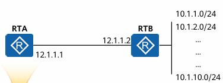
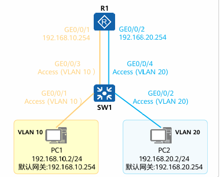

# HCIA
## 概念
网络设备图标

网络通信是指，终端设备之间通过计算机网络进行通讯

交换机： 用于终端用户的接入，对数据帧进行交换
路由器:  网络中的核心设备，连通多个网络，对网络中的数据包进行转发，并且进行路由选择
防火墙： 对流量进行安全审查，对非法数据包进行拦截
无线设备： 提供无线网络通信支持，


## 参考模型 【对于参考模型各层的详细原理参见 **计算机网络第八版 笔记**】
数据是信息传输的载体

1. 物理层： 通过物理介质来建立实际的连接传输数据
2. 数据链路层: 解决在同一条链路上的数据传递的问题，确定在链路上的唯一的物理设备标识MAC地址，并且通过ARP协议来实现IP地址和MAC地址的对照，存储在MAC地址表中。传输单位数据帧
3. 网络层: 在传输层基础上进行的封装，通过路由器实现跨链路的数据传输，还确定了链路（网络）地址和主机地址。并且实现了计算机之间的点对点数据传输.传输单位数据包
4. 传输层: TCP 提供可靠有链接的 udp提供无连接的不可靠的传输协议
5. 应用层: 提供各种服务协议例如http ftp smtp

## 华为VRP系统
华为通用路由操作系统，基于linux开发，存储在flash中

文件系统： 
1. .cc 系统文件
2. .cfg .zip .dat 配置文件
3. .pat 补丁文件
4. .bin PAF 文件

VRP系统可以通过命令行和网页的方式进行配置【ensp不支持网页配置】

VRP系统级别:
| 用户级别 | 命令等级 | 名称 | 说明 |
| --- | --- | --- | --- |
| 0 | 0| 参观 | 网络诊断命令 ping 等 和部分display|
| 1 | 0 1 | 监控 |  用户监控和维护 可以使用diplay|
| 2 | 0 1 2 | 配置| 可以使用配置命令 各层网络命令|
| 3-15 | 0 1 2 3 | 管理 | 可以运行级别系统命令 及下层全部命令 |


VRP 系统命令基本结构:
命令字 关键字 参数名 参数值
display ip int g0/0/0 查看接口信息的命令


VRP视图： 
1. 用户视图 <>标识
2. 系统视图 []标识
3. 接口视图 \[Huawei-GigabitEthernet0/0/1]
4. 协议视图 \[Huawei-ospf-1]


关于命令行:
支持不完整输入 例如dis = display
可以使用tab补全
在关键字后面使用？可以查看帮助信息
在命令前面加undo，则执行undo命令，用于恢复缺省，禁用功能，删除配置


### 基本常用命令
pwd 显示当前目录位置
dir 显示目录下的文件信息
more 查看文件具体内容
cd 切换到指定目录
mkdir 创建新的目录
rmkdir 删除目录
copy 复制文件
move 移动文件
rename 重命名文件
delete 删除文件，删除至回收站
undelete 恢复删除的文件
reset recycle-bin 删除回收站中的文件

### 基本配置命令
```
配置设备名称 【系统视图】
sysname [name]

设置系统时钟 【用户视图】
clock

配置命令等级 【系统视图】
command-privilege level [level] view [view-name] [command-key]

配置用户通过password方式登入设备 【系统视图】
user-interface vry 0 4 
set authentication password cipher [information]

配置接口IP地址 【系统视图】
interface [interface-number]
ip address [ip address]

查看当前运行的配置文件 【用户视图】
display current-configuration

保存配置文件 【用户视图】
save

查看保存的配置文件 【用户视图】
display saved-configuration

清除配置文件 【用户视图】
reset saved-configuration

查看系统配置参数 【用户视图】
display startup

配置系统下次重启使用的配置文件 【用户视图】
startup saved-configuration 

重启设备 【用户视图】
reboot
```
## 网络层及IP 【网络层详细原理参见 **计算机网络第八版 笔记**】
接口配置案例：
```
进入接口视图：
interface [interface-type] [interface-number]

配置接口IP地址:
ip address [ipaddress{mask | mask-length }]
```

## IP 路由基础
路由： 决定数据进行路由转发路径

### 路由表： 
通过各种方式【直连，静态，动态】获取到的路由信息,内容包括 目标网络 下一跳 出接口
路由的获取方式：
- 直链路由： 配置接口时自动生成
- 静态路由： 人为手动设置
- 动态路哟： 通过动态路由协议 *OSPF IS-IS BGP* 等路由协议自动学习，获得
```
Routing Tables: Public
         Destinations : 3        Routes : 3        

Destination/Mask    Proto   Pre  Cost      Flags NextHop         Interface

    10.10.10.1/32  Direct  0    0           D   127.0.0.1       GigabitEthernet0/0/0
    127.0.0.0/8   Direct  0    0           D   127.0.0.1       InLoopBack0
    127.0.0.1/32  Direct  0    0           D   127.0.0.1       InLoopBack0

```
Destination/Mask 目标网络地址/子网掩码
Proto 协议类型 
Pre 路由优先级 【值越小优先级越高】
Cost 开销  (度量值)
Flags 标志 
NextHOP 下一跳地址
Interface 出接口


优先级：
- 值越小优先级越高
- 每一个路由协议都有想对应的路由优先级
| 路由来源 | 路由类型 | 默认优先级 |
| --- | --- | ---| 
| 直连 | 直连 | 0 | 
| 静态 | 静态 | 60 | 
| 动态 | OSPF内部路由 | 10 |
| 动态 | OSPF外部路由 | 150 |
**在优先级相同的时候会使用度量值进行比较**


开销/度量值: 
- 计算到达目标网络中链路的性能，会根据 跳数 带宽 延时 代价 负载 可靠性 综合计算出一个指标
- 值越小优先级越高


### 路由转发
***最长匹配原则***
192.168.0.0/16 和 192.168.2.0/24 会优先匹配192.168.2.0/24
注意：若路由表【一般情况不可能】出现两个172.16.0.0网络，但是一个掩码为16 一个掩码为24会优先和掩码为24的172.16.0.0网进行匹配


### 静态路由
缺省路由/默认路由: 
目标网络和子网掩码都为0的网络

静态路由配置命令：
```
ip route-static ip-address{mask | mask-length} [interface-type interface-number] [nexthop-address] 
```
一半情况下 interface-type interface-number 和 nexthop-address 可以二选一，一半选择nexthop-address填写 
对于点对点接口可以只填写出接口
对于广播和VT接口必须填写下一跳
例：
```
ip route-static 10.10.10.0 255.255.255.0 20.20.20.0
```
默认路由配置：
ip route-static 
例:
```
0.0.0.0 0 20.20.20.0
```

### 动态路由 
根据路由算法自动获取路由信息：
常见的动态路由协议: RIP OSPF IS-IS BGP

### 路由特性 
1. 路由必须有直连的下一条才能转发，对于不是直链的路由还需要计算一个活多个中级路由才能进行中级转发，这叫做路由迭代（路由递归）
2. 目标相同，优先级和开销相同的路由 叫做等价路由，若路由表中存在2条及以上的等价路由则会执行负载均衡
3. 浮动路由: 可以理解为备份路由，在链路正常的时候不会被算入路由表中，直在链路出现故障的时候生效


### CIDR 无类编址
目前互联网的地址编码方式，及不再按ABCD类进行分类。而且是直接通过子网掩码来区分网络好主机

### 路由汇总
可以将多条去往相似地点的路由进行汇总，可以实现缩小路由表的目的

下图RTA 去往10.1.X.0/24网络 的下一跳是12.1.1.2。那么可以将路由表汇总成10.1.0.0/26。已达到缩小路由表的目的



## 交换技术

以太网技术：
以太网技术是建立在以CSMA/CD基础上的广播型局域网

冲突域: 
在同一个通讯介质上的所有节点的集合，同CSMA/CD技术可以解决设备在同事发生数据时候的冲突问题

广播域:
广播报文能到达的所有区域

***以太网及MAC地址详细，请参课计算机网络第八版 笔记***

MAC地址
MAC 地址前24为厂家地址,后24位为设备地址
MAC地址的三种分类
- 单拨: 前8为的最后一位是0 XXXXXXX0 XXX...
- 组播：前8为的最后一位是1 XXXXXXX1 XXX...
- 广播：全为F FFFFFFFF FFFF...


交换机的工作原理:（假设交换机地址表为空）
1. 交换机从G0口收到A发出的数据包，将A的MAC地址和接口做绑定
2. 查找交换机的MAC地址表
3. 没有在地址表中找到目标MAC地址
4. 对数据帧进行泛洪水操作
5. 待目标主机回复后，将目标B主机和G1口绑定【假设B接在G1口上面】

交换机对数据的三种处理方式：
1. 泛洪： 向除开原接口的所有接口转发数据帧【泛洪和广播有区别，广播帧会向所以接口转发，包括原接口】
2. 转发： 根据MAC地址表进行转发
3. 丢弃： MAC地址表中没有，并且泛洪后没有回复数据帧的，则执行丢弃


### 补充
二层计算机之间的通信过程：【A 192.168.1.10    B 192.168.1.20】
1. 计算机A要发一个数据包到计算机B。先对IP地址做按位与计算
2. 发现AB在同一个局域网内，则使用ARP协议直接查找对方IP地址，不发送至路由进行处理
3. ARP协议 执行过程，先发送广播帧，广播帧内容包括自己的IP地址和MAC地址。
4. 主机B收到A的广播帧后会将A的MAC地址和IP地址，写入自己的MAC地址缓存中，并且用单拨的方式发生回复信息
5. 主机A在收到主机B发生的回复信息后，会将主机B的MAC地址和IP地址写入自己的MAC地址缓存中，下次通讯就无需再使用ARP协议。
**注意 ：MAC地址缓会在一定的时间后清除缓存信息，到时则需要重新执行ARP协议

## VLAN 虚拟局域网
VLAN的作用：
交换机可以隔离冲突域但是没法有效隔离广播域，但VLAN技术可以有效隔离广播域

VLAN的实现方式：
在二层数据帧原MAC地址和类型中间添加一个tag字段
1. 交换机在收到计算机A发出的数据帧后会在帧上面添加一tag字段
2. 在发出数据包的时候再根据接口类型觉得要不要摘除数据帧中的tag字段

LVAN的划分方式：
基于接口，基于MAC地址，基于IP地址，基于协议，基于策略

### 基于接口的划分
交换机的接口模式：
1. Access： 只能加入一个VLAN并且只能识别无tag的的用户终端，收到无tag的帧会加上行对于的VLAN标签，转发带tag的帧会将帧摘除后转发
2. Trunk： 允许携带tag的帧通过，并且也运行多个VALN通过
3. Hybrid: 可以理解为自定义接口，可以根据需求直接对VLAN 的 tag 帧进行操作
可以通过下面选项对下面内容进行操作
- pvid: 设置接口的默认VLAN 在收到数据帧的时候会对数据帧打上tag标签 
- tagged：设置允许哪些带tag的帧通过
- untagged： 设置那些帧在通过VLAN 时不会被打上tag标签，被打上tag标签的会被摘除
- vlan 

### 基于MAC地址的VLAN划分
在协议模式下
mac-vlan mac-address [mac-address{man_address-mask | mac-address-mask-length}]


### 实现VLAN之间的通信：
VLAN 之间由于隔离个广播域，所以二层无法处理VLAN，若要实现VLAN之间的通讯，必须要要通过三层实现

实现VLAN之间的通信可以使用下面的几种方式实现
1. 使用路由器的物理接口

需要注意 路由器一般情况下是无法处理携带VLAN数据帧的，所以交换机的4个接口需要设置为Access模式，又因为Access接口只能容纳一条VLAN，所以若要实现两个VLAN之间的通信，需要使用两个和路由器相互连接
2. 使用子接口/逻辑接口
子接口/逻辑接口: 将一个逻辑接口虚拟成多个逻辑接口
路由器可以配置子接口，并且可以处理VLAN数据。但需要注意，此时交换机需要配置接口模式为trunk模式。

子接口对VLAN的处理只有两种： 
a. 对于收到的报文剥离tag 进行三层转发或者其他处理
b. 对于发出的报文添加tag后进行发送

子接口配置方法：
```
int E0/0/1.10                       #设置子接口，在接口的后面加.ID
dot1q termination vid [vlan-id]     #设置接口启用802.1Q协议，接受指定的VLAN ID
ip address X.X.X.X [netmask]        #设置子接口的IP地址
arp broddcast enable                #启用arp广播，子接口默认不启用arp广播，若不器用arp关播则和导致arp协议不可用，导致链路无效
```

3. 使用三层交换机的VLANIF接口进行配置
三层交换机是在二层交换机的基础上添加了部分三层的路由功能，VLANIF是三层的逻辑接口，支持对VLAN tag进行操作

VLANIF接口的配置方法;
```
vlan ba 10                      #创建VLAN10
int Vlanif 10                   #进入VLAN10 逻辑接口
ip address 192.168.10.254 24    #设置VLAN10 设置逻辑接口的IP地址
```


### 命令配置
查看VLAN有关的命令
```
查看vlan信息
dis vlan 

查看接口vlan信息 
dis port vlan a

查看mac地址绑定的VLAN
dis mac-vlan mac-address all
```

VLAN创建命令
```
全局模式下配置

vlan [vlan-id]
vlan batch [vlan-id1] [vlan-id2] [vlan-id3]
```

Access接口命令配置：
```
接口模式下配置

设置接口模式
port ling-type acess
将接口划分到指定的VLAN中
port default  vlan [vlan-id]
```

Trunk 接口配置命令
```
接口模式下配置

设置接口模式
pork link-type trunk
配置接口加入指定的VLAN，或者说允许指定的VLAN从这个接口通过
prot trunk allow-pass [vlan-id | all]
【可选】配置trunk 接口的缺省VLAN
port trunk pvid [vlan]
```

Hybrid 接口配置
```
接口模式下配置

设置接口模式
port link-type hybrid

配置案例1 将hybrid接口模拟成access接口
port hy pvid vlan 10
port hy unta vlan 10

配置案例2 将hybrid 接口模拟成trunk接口
port hy ta vlan 10 20
```


基于MAC地址配置的VLAN
```
创建VLAN10 
vlan 10 【进入协议模式】

关联MAC地址和VLAN
mac-vlan mac-address XXXX-XXXX-XXXX...

退出 
q

配置接口,为hy模式，并且运行vlan10 通过
int g0/0/1
port lin-typr hy
port hy tagged vlan 10

配置其他接口 拆除vlan10的tag并且使能MAC地地址
int g0/0/2
port lin-typr hy
port hy untagged vlan 10
mac-vlan enable
```

使用子接口/逻辑接口
```
int E0/0/1.20
dot1q termination vid 20
ip address 192.168.20.0 255.255.255.0
arp broddcast enable
```

VLANIF接口的配置方法;
```
vlan ba 10                      #创建VLAN10
int Vlanif 10                   #进入VLAN10 逻辑接口
ip address 192.168.10.254 24    #设置VLAN10 设置逻辑接口的IP地址
```

## STP
用于解决二次环路可能产生的问题【广播风暴 MAC地址表飘逸】
生成树的原理:
将一个形成环路的一个接口进行逻辑阻塞，能接受业务报文，只是不镜像转发

阻塞过程:
1. 交换机会根据BID，和优先级 选取出一根桥交换机其他的为非更桥交换机
2. 再根据PID RPC cost来决定阻塞哪个接口
3. 完成阻塞后会周期性的发送BPDU报文，确保链路的稳定系


- 优先级： 交换机可以配置STP优先级，优先级低的会被有限选择为根桥交换机，优先级默认为 4096 取值范围为0-65535 修改的值必须为4096的倍数
- BID: 桥ID 每个交换机的MAC地址都是不一样的，在交换机优先级相同的时候会比较桥ID，交换机会互相交换BPDU报文，并且对MAC地址进项按位比较，MAC地址最小的为根桥交换机
- cost： 开销，每个交换机的端口都有开销，接口带宽越大Cost值越小
- RPC： 路径开销，到达根桥交换机的路径值，RPC计算：从改设备到根桥交换机的途中的Cost值累加
- PID: 接口ID，由接口ID和优先级构成，接口ID就是安装G0/0/0-G0/0/10的顺序一次排开 优先级取值0-240 默认为128
- 根桥： 交换机机种根的概念，一个网络的逻辑核心，会周期性的发出BPDU报文
- BPDU报文： 交换机的各项属性和状态都会封装在BPDU报文中

接口属性：
RP: 根桥接口通往根桥最小的接口，会接受来自根桥的BPDU报文
DP： 指定接口，每个链路上只能有一个DP接口，DP接口会负责业务报文的转发
AP： 阻塞接口，就接受BPDU报文，丢弃业务报文

STP的接口状态:
|状态|表述|
| --- | --- |
|禁用|不接受也不转发任何报文|
|阻塞|不发送BPDU报文，但接受BPDU报文，不收发业务数据|
|侦听|处于STP计算中 接受BPDU报文，不转发业务数据 也不会进项MAC地址表的学习|
|学习|侦听业务数据帧学习MAC地址但不会转发业务数据|
|转发|转发和处理业务数据和BPDU报文，链路中只RP和DP会处于该状态|


STP选举和计算过程: 
1. 交换BPDU报文比较优先级
2. 优先级相同的时候比较桥ID，最小的被选举为根桥，并且向其他交换机持续的周期性的发送BPDU报文
3. 非根交换机会根基自己收到的BPDU报文 计算一个离根桥交换机最近最有的接口为RP【计算过程：先更具RPC来定，RPC相同时会根据BID来定】
4. 根据RPC和BID选择出指定端口DP 一条链路中只能有一指定端口
5. 其他的非指定接口和根端口都会被阻塞
注意：当有新的交换机接入进拓扑后STP都会重新计算


### 基本命令
修改生成树模式 全局模式[]
```
stp mode stp
```

配置根桥 全局模式[] promary主根 直接将优先级改为0/secondary副根 优先级为4096
```
stp root [promary/secondary] 
```

配置STP优先级 全局模式[]
```
stp priority [0-32768]
```

配置接口优先级 接口模式
```
stp priority [0-240]
```

启用STP
```
stp enable
```

## 链接聚合
将多条物理线路虚拟仓一条逻辑线路，实现链路性能的翻倍

手动模式:
手动配置链路，并且不支持LACP，当有逻辑链路中有一条出现问题的时候，逻辑链路不可用


LACP模式
使用LACP协议来事项链路聚合

LACP工方式
1. 互相发送LACPDU报文，来交换信息，确定主动端
2. 先比较优先级，再比较MAC地址，约小约优
3. 选择活动接口和备用接口
4. 活动接口是通过优先级+PID来选取的，优先级越小越优
注意：LACP的信息都是由主控端进项

LACP存在最大活动接口数量，默认是8
当活动接口出现故障的时候备用接口会启用


LACP负载均衡的模式
1. 基于包的负载均衡，数据包会按照顺序依次从活动接口依次发出，但可能会导致包乱序
2. 基于流量的负载均衡，基于流量的负载均衡可以根据流量的来源自动选择发出的线路，对于来源相同的流量会尽量设置从一条链路上发出，可以有效的解决包乱序的问题

### 配置案例

手动创建负载均衡:
```
inter eth-trunk [ID]            #创建一个聚合接口，并且进入接口视图

mode manual load-balance        #设置负载均衡为手动模式

trunkport G0/0/1                #将G0/0/1加入到聚合链路中

mixed-rate link enable          #运行不同速率的接口加入到聚合口中

q                               #退出接口模式

int G0/0/2                      #进入G0/0/2接口

eth-trunk [ID]                  #把接口添加到聚合接口中

q                               #退出接口模式

int E0/0/1                      #进入E0/0/1接口

eth-trunk [ID]                  #把接口添加到聚合接口中
```

使用LACP实现负载均衡
配置LACP优先级
```
lacp priority [0-32768，默认为32786]
```

设置LACP接口优先级
```
lacp priority [优先级]
```

配置最大活动接口
```
max active-linknumber [number]
```

配置最小活动接口
```
least active-linknumber [number]
```

案例：
```
int eth-trunk 1                 # 创建一个聚合接口
mode lacp                       # 设置为lacp模式
max active-linknumber 3         # 设置最大活动接口数据
trunkport G 0/0/1 to 0/0/4      # 将G 0/0/1到0/0/4接口划入聚合接口
q                               # 退出接口模式
```

## 交换机堆叠
堆叠：将多台交换机用堆叠线连在一起，从逻辑上变成一台交换机
集群：将多台支持集群特性交换机用堆叠线连在一起，从逻辑上变成一台交换机。假设服务器集群X Y都有两条线分别连接交换机A B，如果交换机AB做集群，逻辑成一台交换机S，这时候服务器集群XY 相当于以链路聚合的形式连接了交换机S

## ACL访问控制列表原理配置
ACL范围控制列表，可以对数据包进项精确管控


ACL的分类：
|分类|编号范围|规则描述|
|---|---|---|
|基本ACL|2000-2999|仅支持识别原IP地址，定义规则|
|高级ACL|3000-3999|能识别原IP地址，目标IP地址，IP协议，端口号，生效时间来定义规则|
|二层ACL|4000-4999|根据原MAC地址和目标MAC地址，二次协议等定义的规则|
|用户自定义ACL|5000-5999|使用报头，位置偏移，字符串掩码和用户自定义字符串定义规则|
|用户ACL|6000-9999|即可以使用IP地址 UCL IP协议 ICMP协议，端口等定义规则|

ACL的表示方法:
1. 数字型ACL： 在创建ACL的时在后面接数字
2. 命名型ACL： 用名称代替ACL标识

创建ACL命令:
创建ACL
```
alc [2000-9999] 
```
添加ACL
```
rule [rule-id] {deny | permit} {规则配置，基础的和高级的不一样}
```

ACL规则编号规则：
在添加规则的时候会有一个rule-id 这个选项可以选填
默认值是5在同一个ACL列表中每次添加规则值会自动往后加5
这样设置rule-id是方便日后可以更加好的在旧规则直接添加新的规则


ACL通配符：
在基本ACL配置中:
rule 5 deny source 10.1.1.0 0.0.0.255
存在通配符
以适配一段范围内的地址
通配符的匹配原理;
对地址进项按位比较，通配符为0时后表示匹配，1表示任意
00001010.00000001.00000001.00000000
00000000.00000000.00000000.11111111 规则会按找通配符严格执行。
若只要限制地址1-127的主机通配符的最后8为2位
10.1.1.1
0.0.0.01111110 写为0.0.0.126

ACL工作机制:
1. 当配置了ACL的设备收到了一个报文后会按照2000-9999的顺序去和规则匹配
2. 当匹配上后则会更具规则配置的操作去执行是放行或丢弃

ACL规则列表写好后并不会自动应用，需要手动配置接口采用哪一种规则列表
对接口采用规则列表存在入接口和出接口的关系
用一个拒绝的规则做示例
入站inbound：数据包在入站前会被检测，并且丢弃，所以数据包无法进入设备内部
出站Outbound：数据包会进入设备内存，当尝试从规则配置ACL的接口出时会被检测，由于是拒绝，所以数据包不会从接口发出，而是被设备丢弃

### 命令案例：
使用基本ACL过滤流量
```
acl 2000
rule deny source 192.168.1.1 0
rule permit source any 
q
int G0/0/1 
traffic-filter inbound acl 2000
q 
```
补充解释：由于设备会对数据包进行检测，192.168.1.1能被检查到，并且会被丢弃。但出192.168.1.1的其他数据包每次被检测到，设备可能不会对数据包进行转发，所以需要添加
rule permit source any
对其他的所有数据放行操作，由于存在规则rule-id，设备先匹配192.168.1.1


使用高级ACL限制用户不能访问指定IP
```
acl 3001
rule deny ip  des 192.168.1.1 0
q
int G0/0/2
traffic-filter outbound acl 30001
q
```

## NAT地址转换
将私网络地址转换为公网地址，使得内网能够访问公网

静态NAT：
将内网地址和公网的地址做绑定【现实中基本不用，因为这样配置并没有解决公网地址不足的问题】
配置案例:
```
在接口视图下配置
nat static globla 122.1.1.9 inside 192.168.1.1
```

动态NAT：
在静态NAT的基础上建立了一个地址池。类似dhcp。若主机需要上网则从地址池中分配一个出来，若地址池中没有地址了，则要上网的主机需要等待其他主机使用完将地址放回地址池中。才能上网【现实中基本不用，因为这样配置并没有解决公网地址不足的问题】
配置案例：
```
nat address-group 1 122.1.1.1 122.1.1.2 122.1.1.3
acl 2000
rele permit source any
q
int G0/0/1 
nat outboudn 2000 address-group 1 no-pat       #no-pat不带端口号的映射
```

NAPT:
在NAT地址转换的时候不仅仅转换IP地址，也会对端口号进项转换。可以实现一个公网IP转换N个私有的IP地址
需要注意：NAPT是在动态NAT上做的改进，所以NAPT是存在地址池的
工作原理：
1. 路由器收到一个原IP192.168.1.1:10086 目标122.1.1.1:80的数据包
2. 路由器在NAT地址映射表中添加了一条内网的10086端口对应的是公网的10000端口
3. 路由器修改了IP数据报文，将IP地址修改为自己的公网IP地址，原端口修改为10000，目标端口不做修改，并且将数据包转发出去
   当路由器收到了122.1.1.1:80发会的数据包会将数据包的IP地址从公网地址改回私网地址，根据NAT表将端口改回10086端口

Easy IP:
需要注意：Easy IP 是在NAPT上做的优化，并不存在地址池，适合用在不具备固定公网IP的地方，比如家宽
工作理同NAPT，只是没地址池

NAT server：
只是将Easy IP 的转换过程逆向，一帮用于访问在私网中的服务器

## AAA身份认证
暂无记录，可能要到IP课程中
