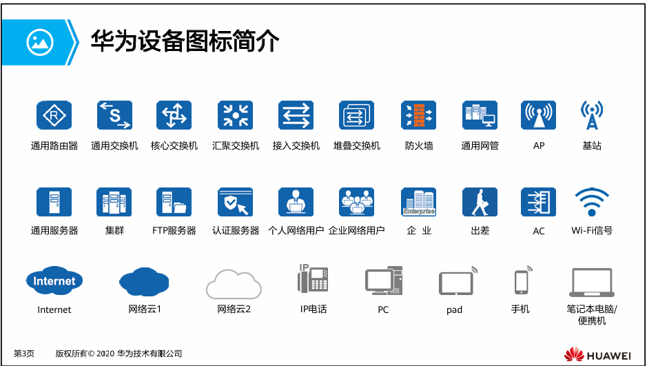
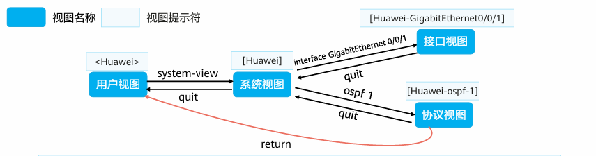

# HCIA
## 概念
网络设备图标

网络通信是指，终端设备之间通过计算机网络进行通讯

交换机： 用于终端用户的接入，对数据帧进行交换
路由器:  网络中的核心设备，连通多个网络，对网络中的数据包进行转发，并且进行路由选择
防火墙： 对流量进行安全审查，对非法数据包进行拦截
无线设备： 提供无线网络通信支持，


## 参考模型 【对于参考模型各层的详细原理参见 **计算机网络第八版 笔记**】
数据是信息传输的载体

1. 物理层： 通过物理介质来建立实际的连接传输数据
2. 数据链路层: 解决在同一条链路上的数据传递的问题，确定在链路上的唯一的物理设备标识MAC地址，并且通过ARP协议来实现IP地址和MAC地址的对照，存储在MAC地址表中。传输单位数据帧
3. 网络层: 在传输层基础上进行的封装，通过路由器实现跨链路的数据传输，还确定了链路（网络）地址和主机地址。并且实现了计算机之间的点对点数据传输.传输单位数据包
4. 传输层: TCP 提供可靠有链接的 udp提供无连接的不可靠的传输协议
5. 应用层: 提供各种服务协议例如http ftp smtp

## 华为VRP系统
华为通用路由操作系统，基于linux开发，存储在flash中

文件系统： 
1. .cc 系统文件
2. .cfg .zip .dat 配置文件
3. .pat 补丁文件
4. .bin PAF 文件

VRP系统可以通过命令行和网页的方式进行配置【ensp不支持网页配置】

VRP系统级别:
| 用户级别 | 命令等级 | 名称 | 说明 |
| --- | --- | --- | --- |
| 0 | 0| 参观 | 网络诊断命令 ping 等 和部分display|
| 1 | 0 1 | 监控 |  用户监控和维护 可以使用diplay|
| 2 | 0 1 2 | 配置| 可以使用配置命令 各层网络命令|
| 3-15 | 0 1 2 3 | 管理 | 可以运行级别系统命令 及下层全部命令 |


VRP 系统命令基本结构:
命令字 关键字 参数名 参数值
display ip int g0/0/0 查看接口信息的命令


VRP视图： 
1. 用户视图 <>标识
2. 系统视图 []标识
3. 接口视图 \[Huawei-GigabitEthernet0/0/1]
4. 协议视图 \[Huawei-ospf-1]


关于命令行:
支持不完整输入 例如dis = display
可以使用tab补全
在关键字后面使用？可以查看帮助信息
在命令前面加undo，则执行undo命令，用于恢复缺省，禁用功能，删除配置


### 基本常用命令
pwd 显示当前目录位置
dir 显示目录下的文件信息
more 查看文件具体内容
cd 切换到指定目录
mkdir 创建新的目录
rmkdir 删除目录
copy 复制文件
move 移动文件
rename 重命名文件
delete 删除文件，删除至回收站
undelete 恢复删除的文件
reset recycle-bin 删除回收站中的文件

### 基本配置命令
```
配置设备名称 【系统视图】
sysname [name]

设置系统时钟 【用户视图】
clock

配置命令等级 【系统视图】
command-privilege level [level] view [view-name] [command-key]

配置用户通过password方式登入设备 【系统视图】
user-interface vry 0 4 
set authentication password cipher [information]

配置接口IP地址 【系统视图】
interface [interface-number]
ip address [ip address]

查看当前运行的配置文件 【用户视图】
display current-configuration

保存配置文件 【用户视图】
save

查看保存的配置文件 【用户视图】
display saved-configuration

清除配置文件 【用户视图】
reset saved-configuration

查看系统配置参数 【用户视图】
display startup

配置系统下次重启使用的配置文件 【用户视图】
startup saved-configuration 

重启设备 【用户视图】
reboot

```
## 网络层及IP