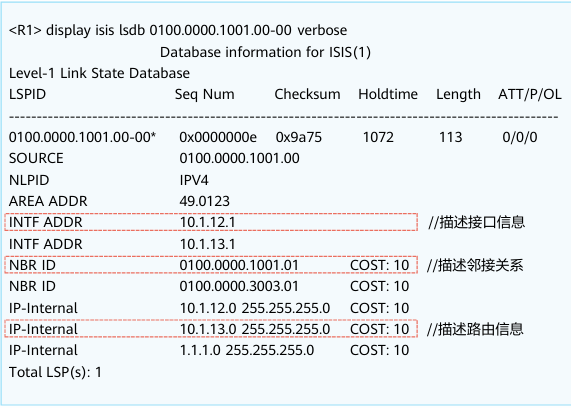
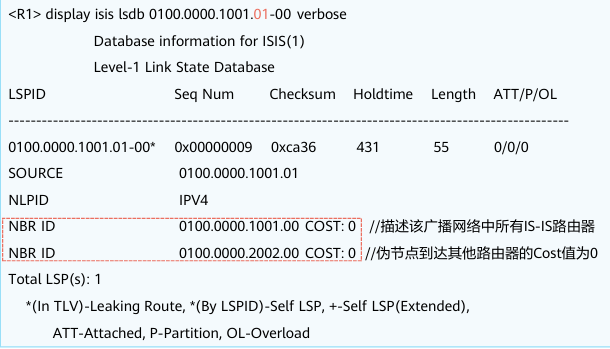
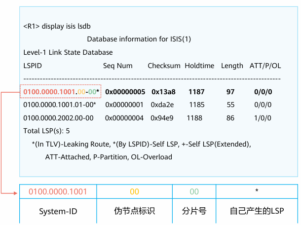
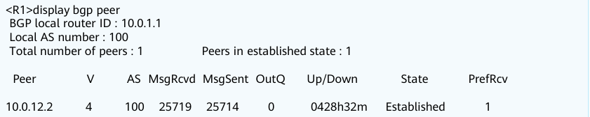
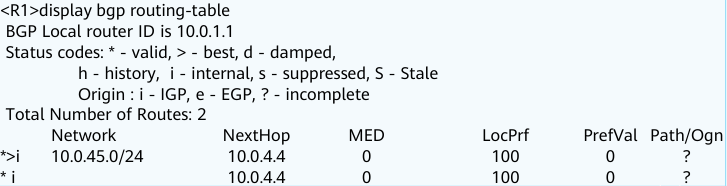
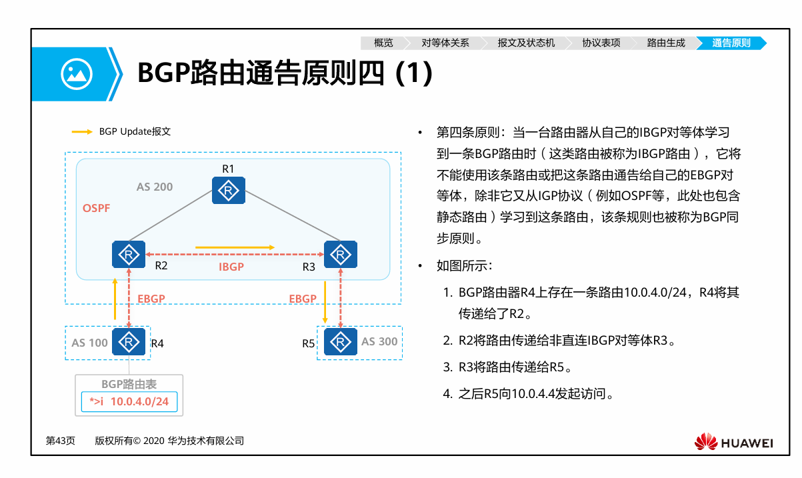
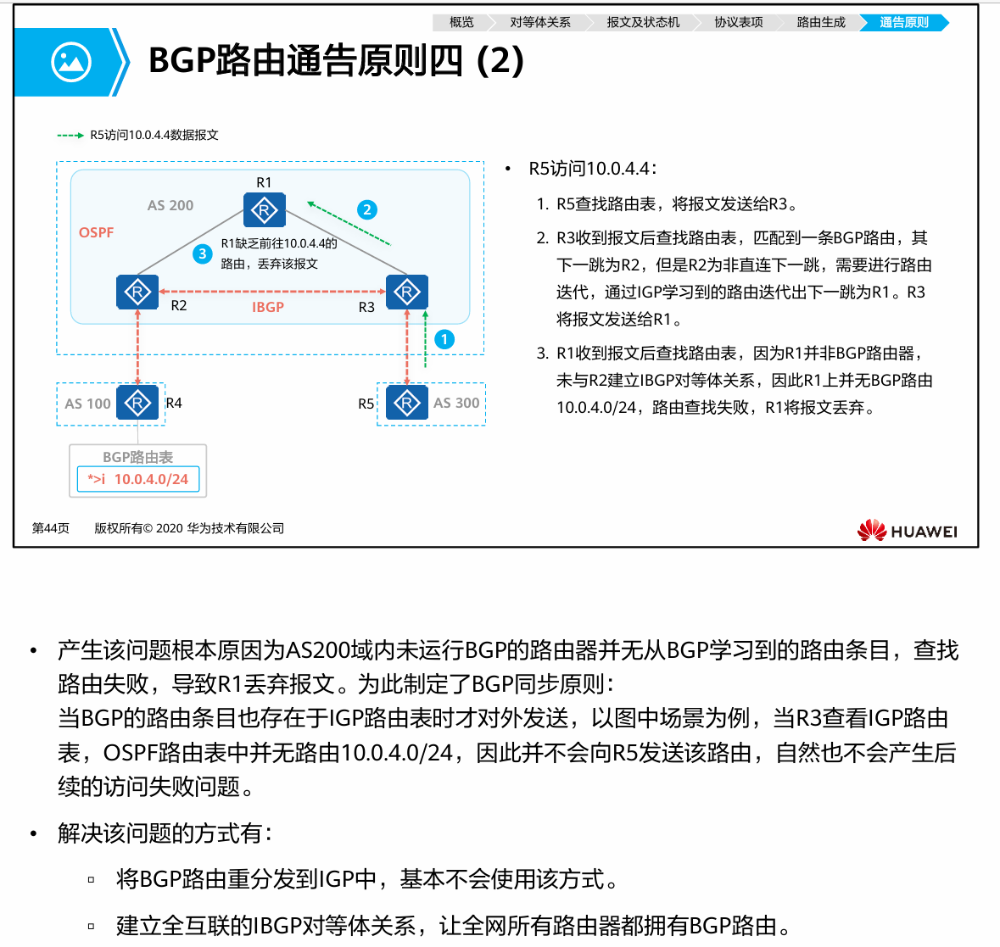
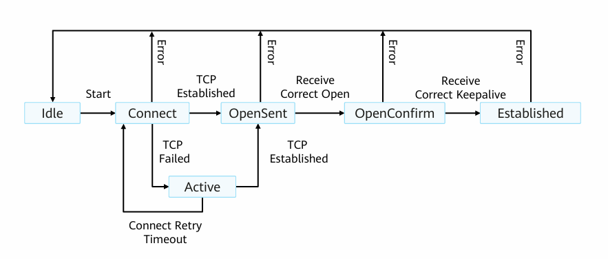
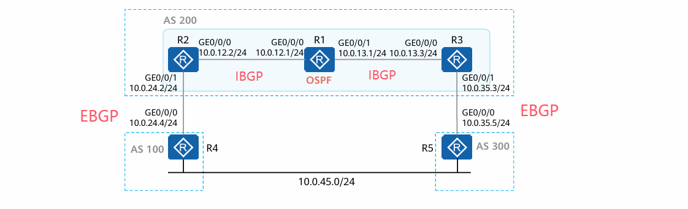

# HCIP

## OSPF

一种基于链路转态的内部网关协议

### 核心思想

1. 路由和路由之间先建立连接关系
2. 相互交换自己路由和链路信息【泛洪】
3. 当路由器掌握了**本区域**的路由和链路信息后开始路由计算
4. 将计算结构写入路由表中

### 基础术语/参数/概念

Router ID: 用于标识自制系统中唯一的一台路由器【不是IP地址】，参数格式是一个32位无符号整数
Router ID选举规则：

- 手动指定【在项目中一般使用路由器的管理接口作为router ID】
- 如果没有手动指定则使用Loopback接口中最大的IP地址作为Router ID
- 若没有配置Loopback则使用物理接口中最大的IP地址做完Router ID

配置命令

```
ospf 进程号 Router-id [Router ID]
```

度量值： Cost 开销，每一个接口都有自己的开销
开销的计算方法：100 Mbit/s / 接口带块。若计算出来的cost小于1则按1算
累计cost 就是将链路上的所以出接口的cost值相加
cost值可以自己修改
配置命令【在接口视图下】

```
ospf cost 开销值
```

区域：
在大型园区网络中会有许多的路由，为了减轻路由表的计算压力会将OSPF进行区域划分
ospf Area用于标识一个OSPF区域
在ospf区域标识没有明确的顺序要求，但要求必须存在0区域，【一般也是从0区域开始按照顺序往后划分】
配置命令

```
ospf 1
area 区域号
```

邻居表：
在OSFP进行运算之前需要先建立邻居表，已便于知道哪些路由和自己是相邻的关系
邻居关系通过Hello报文建立和维护，可以使用dis ospf peer 查看

LSDB：
Link state database 链路转态基础数据。用于保存自己产生和从邻居收到的LSA信息
可以使用dis ospf lsdb命令查看

OSPF路由表：
OSPF路由 **不等于** 普通路由表
OSPF路由表时更具LSDB计算出的一份路由表
用于存储OSPF网络的路由信息
可以使用dis ospf routing 查看

```
Destination     Cost    Type    NextHop     AdvRouter   Area
10.0.1.1/32     0       stub    10.0.1.1    10.0.1.1    0.0.0.0
10.0.1.1/30     1       Transit 10.0.12.1   10.0.1.1    0.0.0.0
```

Destination: 目标网络
Cost: 开销
Type: 路由类型
NextHop: 下一跳路由
AdvRouter: 目标路由ID
Area: 区域信息

OSPF报文格式和类型
OSPF报文是封装在IP数据报中的，协议号89

OSPF报头格式

```
*IP头部*
**********************************
* Version * Type * packer Length *
*           Rouser ID            *
*           Area ID              *
*     Checksum   *  Auth Type    *
*        Authentication          *
**********************************
*OSPF数据部分*
*IP尾部*
```

Version：版本
Type： 类型字段
packer Length：整个OSPF报文长度
Rouser ID: 生成改报文的路由器ID
Area ID： 需要告知的区域
Checksum：校验字段，校验包括OSPF报文头部的整个OSPF报文
Auth Type：是否需要认证，0标识不认证，1标识简单的明文密码验证，2标识使用MD5摘要算法认证
Authentication： 认证信息，根据 Auth Type 的值而定

OSPF的5种报文类型

| Type | 报文名称           | 报文功能                |
| ---- | ------------------ | ----------------------- |
| 1    | Hello              | 发现和维护邻居关系      |
| 2    | database           | 交互链路信息摘要【LSA】 |
| 3    | Link state Requset | 请求特定的链路信息      |
| 4    | Link state update  | 发生详细的链路信息      |
| 5    | Link state ACK     | 确认LSA                 |

#### LSA

LSA是OSPF进行链路计算的关键依据
LSA中包含了链路和链路有关的几乎全部信息
LSA 一般存在 OSPF数据报的 OSPF数据部分

OSPF数据部分 LSA报文格式【头部】

```
******************************
* LS Age * Options * LS Type *
*       Link State ID        *
*     Adverising Router      *
*    LS sequence number      *
* LS checksum *   length     *
******************************
```

LS Age ：LSA已经存在的时间
Options: 可选项：OSPF对应的特性
LS Type：LSA类型【1-5 7】
Link State ID：根据LSA类型来定
Adverising Router ：产生LSA的路由ID
LS sequence number：链路转态序列号，当LSA有新的实例产生时，序列号增加1
LS checksum： 校验和
length： 包含LSA头部在内的LSA长度

LSA类型

| 类型 | 名称              | 描述                                                                                                     |
| ---- | ----------------- | -------------------------------------------------------------------------------------------------------- |
| 1    | 路由SLA           | 每个设备都会产生，用于描述自己的链路和开销，产生后会在接口指定的区域内泛洪                               |
| 2    | 网络SLA           | 由DR路由产生，描述MA网络形成的路由关系                                                                   |
| 3    | 网络汇总SLA       | 由ABR产生，用于描述一个区域内的路由信息                                                                  |
| 4    | ASBR汇总LSA       | 由ABR产生，用于描述到达ASBR路由的信息，并且可以跨区域                                                    |
| 5    | AS外部SLA         | 由ASBR，用于描述OSPF的外部路由                                                                           |
| 7    | 非完全末梢区域SLA | 和5类SLA类似，但是只能在NSSA的特殊区域中使用，在跨越区域的时候ABR会将7类SLA转换为5类SLA注入到Area0区域中 |

LSA描述网络的核心思路：
将自己所相接的网络和邻居转化为带权有向图

带权有向图描述网络链路信息的方式/思路

- StubNet:
  用于描述路由器到一个stub网段信息【例如Loopback接口】
  可以理解为，路由器的末端网络。可以直接链接PC，server等业务设备
- p2p:
  用于描述两个路由相连接的点对点网络
  携带开销值为接口的出口开销
- TransNet：
  用于描述多个路由器互联的的关系

  ```
  *******************
  *       R         *
  *       |         *
  *       |         *
  *   R ——S——— R    *
  *       |         *
  *       R         *
  *******************
  ```

  描述过程：

  1. 路由器直接会将假定一个伪节点N1，这N1仅逻辑存在，并不在现实中存在。
  2. 路由器会和这个伪节点N1链接
  3. 对于cost开销的计算，路由器到N1节点的cost开销为路由器自己的接口开销，但是N1伪节点到路由的开销为0

  而对伪节点的描述则为DR路由器的地址【有关DR路由器详细请见下文OSPF路由邻居关系建立】

路由器对LSA的处理机制
但一个路由器收到一个LSA【如果参数相同则按照序号往下比较】

1. 序列号是否相同，否 越大越优
2. 校验和是否相同，否 校验和大优先
3. MAX Age=3600S，否
   比较AGE是否超过15min   是这age小的优先
   否则认为LSA相同，保留先收到的
4. 收到的LSA更优

##### 1类LSA

Router LSA ：
每个路由都会产生的LSA，用于描述该路由器直连的接口信息
router LSA报文格式

```
*OSPF数据部分 LSA报文格式【头部】*
******************************
* 0 * V * E * B * 0 * #links *
*           Link ID          *
*          Link Date         *
* link type * #TOS * metric  *
*              ...           *
******************************
```

字段解释：
V:LSA如果产生的LSA路由是虚链接的端点 值为1 否则为0 【一般默认为0】
E:如果产生此LSA的路由为ASBR 值为1 否则为0
B:如果产生此LSA的路由为ABR 值为1 否则为0
#Lins: LSA中的链接数量
Link ID: 链接参数【根据Link type而定】
Link Data: 链接路由的ID信息【根据Link type而定】
link type: 链接的类型【详细信息见上文 带权有向图】

link type , link data , link ID 和带权有向图的关系
带权有向图的类型是link type的支持，而带权有向图的描述信息则是link data , link ID的参数

| Link Type | Link ID                          | Link Data                        |
| --------- | -------------------------------- | -------------------------------- |
| p2p       | 邻居路由器的Router ID            | 宣告Router LSA路由器接口的IP地址 |
| TransNet  | DR路由器IP地址                   | 宣告Router LSA路由器接口的IP地址 |
| StubNet   | 宣告Router LSA路由器接口的IP地址 | stub网络的网络掩码               |

##### 2类LSA

Network LSA
网络LSA是对MA网络的描述
由DR产生，描述本网段的链路转态【有关DR路由器详细请见下文OSPF路由邻居关系建立】
网络LSA中会描述所有和DR建立了邻居关系的OSPF路由器，并且同时携带该网段的网络掩码

##### 3类LSA

Network Summary LSA
由ABR产生
网络LSA工作原理：

- 若存在Area 0 1 2 三个区域，但由于防环机制，Area 1，区域无法直接和Area 2交换LSA，若要交换LSA则必须要通过Area 0
- 此时Area 1区域中有一条非ABR路由产生的一条路路由信息，并且在Area区域中泛洪。
- 因为OSPF是会根据区域进行路由计算的，所以在Area 1 中非ABR产生的路由条目无法泛洪到其他区域中，所以其他区域无法知道这条产生的新路由
- 为了使得其他区域也能知道这条产生的新路由，此时Area 1的ABR路由就会根据这条路由器产生一条3类LSA，并且告知到Area 0区域中【将LSA 3类报文在Area区域中泛洪】
- 其他区域例如Area 2 ABR在收到 Area 1区域ABR路由产生的LSA后，也会根据这条LSA 重新产生一条新的3类LSA报文，并且告知自己所在的区域Area 2

三类LSA报文格式

```
******************************
* LS Age * Options * LS Type *    //*OSPF数据部分 LSA报文格式【头部】
*       Link State ID        *    //*OSPF数据部分 LSA报文格式【头部】
*     Adverising Router      *    //*OSPF数据部分 LSA报文格式【头部】
*    LS sequence number      *    //*OSPF数据部分 LSA报文格式【头部】
* LS checksum *   length     *    //*OSPF数据部分 LSA报文格式【头部】
*      Network Mask          *
*  0  *      metric          *
*           ....             *
******************************
```

LS Type: 取值为3
Link State ID： 路由器的目标网络
Adverising Router：产生改LSA的路由ID【ABR路由】
Network Mask：目标网络的网络掩码
metric: 到达此路由的开销

##### 5类LSA

在某些情况下OSFP需要引入外部路由
若此时需要将引入的外部路在区域内泛洪就需要5类LSA
此时接入外部路由的这太路由器就是ASBR路路由器，他可以是OSPF中的任意路由器

5类LSA报文格式

```
******************************
* LS Age * Options * LS Type *    //*OSPF数据部分 LSA报文格式【头部】
*       Link State ID        *    //*OSPF数据部分 LSA报文格式【头部】
*     Adverising Router      *    //*OSPF数据部分 LSA报文格式【头部】
*    LS sequence number      *    //*OSPF数据部分 LSA报文格式【头部】
* LS checksum *   length     *    //*OSPF数据部分 LSA报文格式【头部】
*      Network Mask          *
*  E  *  0  *    metric      *
*    Forwarding  address     *
*    External Route Tag      *
*           ...              *
******************************
```

LS Type: 取值为5
Link State ID： 外部路由网段
Adverising Router：产生改LSA的路由ID【ASBR路由】
Network Mask：目标网络的网络掩码
E : 改外部路由使用的度量值类型【见下文】
metric: 到达此路由的开销【需要将E关键纳入考核访问】
Forwarding  address：到所通告的目的地地址的报文将被转发到这个地址，当FA为0.0.0.0时，这到达改外部网段的流量会被引入这跳外部路由的ASBR，若FA不为0.0.0.0则流量会被发往这个转发地址。FA的引入可以使得OSPF在某些特殊场景中的此优问题可以被规避
External Route Tag: 外部路由标记，常被用于部署路由策略

E 类值的标识

- 0 标识度量值类型为Metric-Type-1
- 1 标识度量值类型为Metric-Type-2
  Metric-Type-1 / 2
  的区别在于
  1类会将不仅会急速OSPF内部的cost值，还会将外部路由开销的值一并加上
  2进计算在OSPF内部产生的cost

命令操作

```
ospf 1
import-router 路由类型 路由网络
```

##### 4类LSA

工作模式和3类LSA类似，但是4类LSA是为了解决外部路由引入的通过问题
同3类LSA，若Area 1区域的非ABR设备引入了一条外部路由，并且在Area 1内泛洪5类LSA
Area 1 的ABR路由收到泛洪的5类的LSA，并且根据这条5类LSA产生一条4类的LSA，在0区域泛洪，其他区域同理，收到后也会产生一条4类LSA并且在所属区域内泛洪

报文格式同3类LSA，仅仅只是参数有所改变
LS Typ: 4
Link State ID： ASBR 路由ID
Adverising Router：产生改LSA的路由ID【ABR路由】
Network Mask：保留，无意义
metric: 到达此路由的开销

##### 7类LSA

仅用于解决特殊区域产生的外部路由
由于NSSA区间不允许4类5类LSA泛洪，但又由于NSSA的区域特性，允许外部路由接入，所以添加了7类LSA
但同时7类LSA只能在NSSA特殊区域内泛洪，所以若要将这条LSA告知到其他区域需要ABR路由将根据收到的7类LSA 产生5类的LSA在注入回Area 0区域区域中

7类LSA报文格式同5类LSA

### 工作原理

#### 建立邻居关系

建立邻居关系工作过程概述

1. 路由器直接通过互相发生Hello
2. 协商主从关系
3. 描述各自的LSDB
4. 更新LSA，同步LSDB
5. 计算路由

邻居关系建立：
0. 假设有两台路由器 AB，并且路由器AB上同时运行OSPF

1. 两台路由器每个一定的周期会互相发送Hello报文，但是邻居列表中为空【此时接口转态为Down】
2. B 收到A的Hello报文后如果参数匹配，则将R1加入自己的邻居列表中，再次发生Hello报文，并且【A收到B发出的第一个Hello报文，并且邻居列表中不存在自己时接口模式将从 **Down 改为 Init**】
3. A收到B发出的Hello报文后并且邻居列表中存在自己的时候，则标志着邻居关系建立完成，AB两台路由器的邻居列表中都存在对方的 Router ID【A收到B发出的第一个Hello报文，并且邻居列表中存在自己，接口将从 **Init 改为 2-way**】

Hello报文的作用：

- 发现邻居关系
- 建立邻居关系
- 保持邻居关系

Hello 报文格式

```
*********************************************
*               Network Mask                *
* Hello Interal * Options * Router Priority *
*            RouterDeadinterval             *
*             Designated Router             *
*        Backup Designated Router           *
*               Neighbor                    *
*                  ...                      *
*********************************************
```

参数前面带*的为重要参数
*Network Mask: 接口和子网掩码
*Hello Interal：间隔时间【通常为10s】
Options：E是否支持外部路由 MC 是否支持转发组播数据 N/P 是否为NSSA区域
Router Priority：DR优先级，默认为1，【越小越优先】如果设置为0 则不参加选举
*RouterDeadinterval：失效时间，若在此时间内未收到邻居发来的Hello报文则认为邻居失效【通常为40s】
Designated Router：DR接口地址
Backup Designated Router： BDRR的接口地址
*Neighbor： 邻居列表

#### 建立邻接关系

邻接关系需要再邻居关系的基础上建立
邻接关系建立过程：

1. AB两台路由器会同时发发送DD报文，但改转态下DD报文不包含链路转态信息，并且进行Master选举，【若准备建立邻接关系，接口将从 **2-way 改为 ExStart**，并且开始发送不带链路信息的DD报文】
2. 在计算会后确定Master信息后 *假设是B为主路由*，A会以B发来的DD报文中的seq回复B，并且加上自己的LSDB摘要信息【在收到第一个不携带链路转态信息的DD报文后，接口举将从**ExStart 改为 Exchange** 然后发生带有LSDB摘要信息的DD报文】
3. B在收到A发来的带有LSDB摘要信息的DD报文后会将 seq的值+1并且发生自己带有LSDB摘要信息的报文
4. A收到B发来的DD报文后会对报文基于回复，仅有seq+1的值，不携带任何信息，做为回复的DD报文【A在收到DD报文后会将接口从 **Exchange 改为 Loading**，而B在收到A的回复DD报文后接口也将从**Exchange 改为 Loading**】
   ***注意： 加入双方交互的LSDB摘要信息都是最新的，无许跟新，则接口转态会立马从 Loading 转换为 FULL。或者说直接从Exchange转为FULL***
5. *若交换的LSDB都为最新这不执行这一步* A发送LSR【Link state Requset】，B在收到LSR后会发送对于的LSU【Link state update】。A在收到对于的LSU后会基于LSAck【Link state ACK】确认【完成后接口转态变回从Loading 转换为 FULL】

图示：

```
B..............................A
|  <<DD seq=X I=1 M=1 MS=1     |
|    DD seq=Y I=1 M=1 MS=1>>   |
|                              |
|  <<DD seq=Y LSDB 摘要        |
|    DD seq=Y+1 LSBD摘要 MS=1>>|
|                              |
|  <<DD seq=Y+1                |
```

DD报文格式

```
**********************************************
* Interface MTU * Options * 0 0 0 0 0 I M MS *
*                  DD seq                    *
*                 LSA Header                 *
**********************************************
```

Interface MTU：不片分的情况下可以发出的最大IP报文长度
Options： 同Hello的Options字段
I ：标识是不是第一个DD报文，是则为1，否则为0
M ：标识这是不是最后一个DD报文 是则为0 否则为1
MS：标志是否为主从关系，Router ID大的一方为主，值为1是，标识主
DD seq：确认号

#### DR 和 BDR

MA网络问题：

```
    *******************
    *       R         *
    *       |         *
    *   R ——S——— R    *
    *       |         *
    *       R         *
    *******************
```

MA网络【Multiple Access多路访问】
MA网络进行邻接关系建立的时候因为关系负责，造成大量的资源浪费【重复的LSA泛洪】
解决问题就需要再MA网络中选出一个指定路由DR，并且由MA网络来建立和维护邻接关系，同步LSA。
为了避免DR路由器出现的单点故障，在选举DR路由的时候还会选举出BDR路由器

DR和BDR的选举规则
选举算法：优先级+Router ID   越大越优先
注意，DR和BDR路由是非抢占式的，优先级为0时不参加DR路由选举

#### SPF路由计算过程

1. 构建SPF树干【非StubNet链路类型】
2. 所有的路由都已自己为中心，然后将自己的邻居纳入候选列表
3. 查看候选列表中的开销，开销小的则被选为干节点
4. 向干节点请求LSA，并且将干节点的邻居添加在自己的候选列表，若邻居发来的LSA中和自己列表中的的路由信息重复，则会进行开销比较，若邻居的开销小，则会将自己候选表中的路由信息替换成新的LSA信息，若自己列表中的开销小则不做处理，若开销相同，则会将邻居的LSA信息添加进来，并且在路由表计算的时候，将两个路由一并计算【负载均衡处理】
5. 在干接点发来的邻居表中会找出开销最短的做为自己的新干节点，一次类推，直到将整个网络的路由信息推出来
6. 干接地算出来后再计算叶子信息【处理StubNet链路类型】

事例：
拓扑如下，并且我们假定从R1路由器开始推算【这里为假定的开销值】


1. R1已自己为根，并且根据自己的LSA将所有的非StubNet类型的网络纳入自己的候选列表，R3【48】TransNetR2【1】【R2 R3，**注意R1和R2之间是以太网线路链接，而以太网线路本身就是广播型网络，所以R1-R2直接的路由类型是 TransNet网络，但R1-R2直接的线路严格上来说并不算是MA网络，但R1和R3直接用的是串口线链接，所以构建的就是为P2P网络**】
2. 从自己的候选列表中开销最短的加入自己的最短路径树，由于R2-R1为TransNet网络所以会先纳入伪节点DR，并且向DR请求网络LSA，但是由于此DR只有R1和R2的路由信息，所以R1收到的网络LSA只有自己和R2的路由信息，R1将R2加入最短路径树中，并且向R2请求LSA信息【邻居信息】。
3. 由于R2和R3R5构建了MA网络，所以类型为TransNet【1+0+1】，和R4构建了P2P网络，类型为P2P【1+0+48】，并且将DR的网络LSA和P2P都纳入候选列表中
4. R1将R2的MA网络中的DR路由纳入最短路劲树中，并且由于R1-R3的cost为48，但从R1-R2-R3的路由为1+0+1,所以候选列表中的p2p2会被移除，并且将R2的MA网到R3路由的路由路径加入候选列表
5. R1分别向R3和R5发送LSA请求，R3的LSA中提供的邻居信息都在候选表中，R3的路由信息已经确定，不再变动
6. 在R5回复的路径的报文中存在P2P链接到的R4【48】，R1会对R4的cost进行比较，从R2过开销为【1+0+48】，从R5过开销为【1+0+1+48】，R2的路由更优秀，所以路由不进行变动
7. 在最短路径树构建完成后，再将各个路由StubNet网络以叶子的形式插入在最短路径树上。【将LSA类型为StubNet的网络全部纳入候选列表中】
8. 根据顺序依次算出OSPF路由表，其他所有路由全部完成后，OSPF计算完成，引入路由表中

#### 区间路由计算过程

区间路由计算过程：
0. 假定Area 1区域已经完成了OSPF路由计算，现在需要将区域内的路由信息泛洪到其他区域中

1. Area 1的ABR路由会根据Area1已经计算完成的ospf路由产生一份3类LSA，并且在Area 0 区域中泛洪，并且Area0 区域中接受该LSA的路由COST值会+1，也包括其他区域的ABR路由器
2. 此时Area 2 3..区域的ARB路由收到Area1 路由的泛洪信息后会将根据这份LSA再产生一份LSA泛洪到自己坐在的区域中，并且将COST值再+1
3. 对于外部路由，计算过程同1-3，只是LSA类型会有所不同

#### OSPF区域的防环机制

用于解决可能存在的OSPF区域3层环路问题

1. 所有的Area区域必须和Area 0区域相链接，假如Area1和Area2区域有ABR路由器，但是该ABR路由器不会转发双区域的3类LSA
2. ABR不会将藐视某个区域内的网段再次通过3类LSA注回该区域
3. 从非骨干Area 0 收到的LSA不纳入转发计算

#### 虚链接

会破会OSPF的防环机制，不推荐使用

### OSPF 特殊区域

在OSPF中为了优化网络路由表的规模，和网络性能，所以存在一些特殊区域

#### Stub/ToTally Stub

Stub：
末梢区域，若Area 1为该区域，则Area1为末梢区域，改区域将无法接入外部路由，并且改区域内禁止4类LSA和5类LSA传递，若此时有AS外部路由需要通告，则该区域的ABR路由会生成一个3类LSA在改区域内传输

需要注意：

- 骨干区域不能配置为Stub
- Stub区域内所有的路由都要配置Stub
- 该区域内不能引入AS路由
- 虚链接不能穿越Stub区域

ToTally Stub：
ToTally Stub是在Stub区域上的进行的改进
ToTally Stub除了不允许45类LSA，也将不允许普通的3类LSA区间路由通过进行传递

ToTally Stub 是将AS外部路由和其他区域路由的通过用默认路由代替，通过ABR产生特殊的3类LSA【默认路由信息】进行通告。

配置方法和配置Stub区域相同，值需要再ABR路由器配置Stub时候在后面追加no-summary关键字

#### NAAS/ToTally NSSA

NAAS
不完全末梢区域，和Stub区域类似，但是可以接入AS外部路由。由因为同Stub，所以无法传递45类LSA，但又因为该区域接入了外部路由，所以这边引入了7类LSA。

ToTally NSSA
同ToTally Stub 但是可以接入外部路由，使用7类LSA进行区域内宣告

### OSPF路由特性

1. ABR可以执行路由汇总
2. 可以配置路由的接口为Silent-Interface
   配置成Silent-Interface不会接受和发送OSPF报文，但是仍然可以转发业务数据，并且接口的参数可以参与OSPF的运算
3. OSPF支持报文认证

OSPF认证支持区域认证和接口认证，当两种认证都存在的时候优先使用接口认证
区域认证：在该区域下所有路由器的认证模式和口令必须一致，否则无法加入该区域
接口认证：相邻路由器的直连接口的认证模式必须一致，否则无法连理邻接关系

## IS-IS

IS-IS是OSI中的一种路由链路状态协议，由于在部分场景下OSPF的计算性能可能不够用，所以ISO将ISIS中的部分概念魔改到看TCP/IP体系下

### 核心思想

同OSPF将路由进行分区，然后进行区间路由计算，并且由DIS【OSPF中的DR概念】广播同步链路转态

### 基础术语/参数/概念

NSAP网络服务访问点，类似TCP/IP模型中IP地址的概念

NSAP构成

```
|<-------------------NASP--------------------->|
|<---IDP--->|<----------------DSP------------->|
************************************************
* AFI * IDI * High Order DSD * System ID * SEL *
************************************************
|              1-138         |    6      |  1  |  单位Byte
```

IDP 类似于TCP/IP中的网络号，AFI可以理解为机构，IDI为区域【AFI和IDI 概念不重要】
DSP 类似于TCP/IP中的子网号和主机地址，High Order DSD为区域号， System ID为主机号，SEL为协议号

NET
可以理解为网络中的实体，一个特殊的NSAP，SEL字段为00
例：
49.00001.0000.0000.0001.00

```
          Area ID                 System ID      SEL
           49.00001.             0000.0000.0001.  00
* AFI * IDI * High Order DSD *     System ID   * SEL *
```

区域：
ISIS同OSPF一样存在区域划分，在OSI中设计规划时候划分了3中AS区，但在想TCP/IP迁移的时候做了部分的阉割【修改】，只将区域划分成了2级
骨干区域和非骨干群

路由器的分类
Level-1
若路由器为该级别表示改路由器工作在**非骨干区域**

Level-1-2【默认】
若路由器为该级别表示改路由器工作在骨干区和非骨干区，可以理解为OSPF中的非ABR路由

Level-2
若路由器为该级别表示改路由器工作在**骨干区域**

ISIS支持的网络类型

1. 关播Broadcast 【Ethernet】
2. 点到点p2p

ISIS开销计算:
isis的开销计算有三种计算方式

- 全局计算，为所有接口设置统一的开销
- 接口开销，为单个设置一个开销
- 自动计算开销，根据接口带宽自动计算开销，开销计算方式同OSPF cost=100/接口带块
  需要注意，由于历史原因，自动计算开销的类型为narrow【最大值为63】但是后来的规定中填了的Wide【最大16777215】类型，而华为路由器的ISIS路由默认采用的narrow类型

ISIS报文格式：
ISIS报文是直接封装在数据链路层中的
ISIS报文头部中可以分为专用头部和通用头部

ISIS通用头部

```
**********************************************
* Intradomain Routing Protocol Discriminator *
*               PDU Huader Length            *
*       Version/Protocol ID Extension        *
*            System ID Length                *
* R * R * R *    PDU type                    *
*                version                     *
*                Reserved                    *
*                MAX Areas                   *
**********************************************
```

Intradomain Routing Protocol Discriminator: 区域路由选择协议*固定 0X83*
PDU Huader Length: ISIS 报文头长度【包括通用和专用头部】
Version/Protocol ID Extension: 版本号*固定0X01*
System ID Length: System ID长度
R: 固定保留为 值为0
version: *固定0X01*
MAX Areas: 支持的最大区域个数

ISIS报文类型：
报头中的PDU type类型
一共9种报文，但是可以分成4中类型
IIH: 类似于OSPF中的Hello报文
    L1 LAN IIH    L2 LAN IIH    P2P IIH
LSP：类似于OSPF中的LSA
    L1LSP   L2LSP
CSNP【SNP】：类似于OSPF中的带链路数据的DD带报文，即链路摘要数据
    L1 CSNP   L2 CSNP
PSNP【SNP】：类似于OSPF中的LSR和LSACK
    L1 PSNP   L2 PSNP

IIH 报文：
同OSPF用于建立和维护邻接关系

IIH报文格式：【P2P和关播类型*LAN IIH*不一样】

```
*************************
*   PDU Common Header   *
* Reserved/Circuit type *
*      Source ID        *
*     Holding Time      *
*      PDU Length       *
* R *   Priority        *
* LAN ID 【仅LAN IIH】/ Local Circuit ID*【仅在P2P IIH】*
* variable Length Fields*
*************************
```

Reserved/Circuit type: 标识路由器类型
Priority：DIS选举优先级0-127越大越优先
LAN ID： DIS的System ID和伪节点ID
Local Circuit ID：本地链路ID

DIS伪节点：
可以理解为OSPF中的DR
DIS负责创建和生成伪节点和生成伪节点的LSP
DIS的选举规则：

1. DIS比较DIS的优先级，最大的直接被选为DIS
2. 若优先级相同，则MAC地址最大的被选择为DIS
   DIS和DR的区别

- DIS优先级为0也会参加选举，但OSPF的优先级为0则不会
- DIS运行抢占，但是OSPF不允许
- DIS中所有路由器都会形成邻接关系，OSPF中只有DR和BDR会建立邻接关系

LSP：
可以理解为OSPF中的LSA
LSP分为两种，Level-1 LSP和Level-2 LSP，对应的是Level-1接口和Level-2接口，而Level-1-2接口则可以同时处理这两种LSP
LSP报文格式

```
**************************
*   PDU Common Header    *
*      PDU Length        *
*   Remaining Lifetime   *
*        LSP ID          *
*     Sequence Number    *
*       Checksum         *
* P * ATT * OL * IS Type *
* variable Length Fields *
**************************
```

Remaining Lifetime： LSP生存时间，以秒为单位
LSP ID：System ID + 伪节点ID + LSP分片后的编号
Sequence Number： LSP序列号
Checksum： 校验和
P：保留字段
ATT： 由level-1-2产生，可以理解为是否为ABR路由器，为1则是ABR路由器，0则不是
OL： 过载位标识，在路由器内存不住是才会设置该表示
IS Type：路由器表示，指明是Level-1还是Level-2路由器

**非**伪节点的LSP

AREA ADDR:该LSP来源的区域号
INTF ADDR:该LSP描述的接口信息
NAR ID ： 该LSP中描述的邻接信息
IP-Internal: 该LSP中描述的网段信息

伪节点的LSP：

伪节点的LSP中只包含了邻接信息，不包含路由信息


ISIS的LSDB

伪节点标识：
00标识实节点
非0标识伪节点


CSNP：同OSPF中的DD报文
CSNP 包含了该设备LSDB中的LSP摘要信息，路由器通过CSNP判断LSDB是否需要同步
- 在广播网络上，CSNP由DIS定期发送【默认10秒】
- 在点对点网络上CSNP只在第一次建立邻接关系时候发送
报文格式
```
**************************
*    PDU Common Header   *
*        PDU Length      *
*         Source ID      *
*        Start LSP ID    *
*        End LSP ID      *
* variable Length Fields *
```
Source ID: 发出CSNP报文的System ID 
Start LSP：CSNP 报文中的第一个LSP ID值
End LSP ID：CSNP 报文中的最后一个LSP ID值


PSNP：同OSPF中的LSR和LSACK
当路由器发现自己的LSDB不同步的时候会发送PSNP请求新的LSP
收到LSP的时候会使用PSNP进行同步
报文格式:
```
**************************
*    PDU Common Header   *
*        PDU Length      *
*         Source ID      *
* variable Length Fields *
```
Source ID: 发出PSNP的路由器的system ID

### 工作原理

#### LSP处理机制
当路由器收到一个或者多个LSP是
1. 检查序列号是否相同       否，序列号大的最优
2. 保活时间=0              是，保活时间为0最优
3. 校验和是否相同          否，校验和大的更优先
                          是，不处理LSP

#### ISIS邻接关系建立过程：
关系建立原则：
- 必须处于同一层级
- Area ID必须一致
- ISIS接口的网络类型必须一致
- ISIS地址接口必须处于同一网段
- 开销计算模式必须一样

广播型网络建立邻接的过程: 
R1和R2同时发送IIH报文
假设R2先收到R1的IIH报文

- R2收到R1发出的IIH报文，但是邻居列表中没有自己【接口进入从Down 改为 Initial】
- 然后R2将R1的System ID添加到自己的邻居列表中，并且再次发出IIH报文
- R1 收到了R2 发出的IIH报文，并且在邻居列表中发现了自己的System ID此时会将R2的System ID添加到自己的邻居列表中并且发出IIH报文【接口从Down直接转为UP转态】
- R2再次收到R1发出的IIH报文，发现邻居列表中存在自己的System ID 【接口转态将从Initial 修改为 UP状态】
- 邻接关系建立完成


点对点型网络建立邻接的过程: 
点对点网络在建立邻接关系时只需要进行两位握手即可，即收到IIH 报文直接进入UP转态
但是2次握手存在明显缺陷，即无法解决单点通讯问题
所在华为路由器中设置，点对点网络中建立通讯依然需要需要3次握手

广播型LSP同步过程：
1. 当有一台新路由器R加入isis时，会先发送IIH报文和链路上的路由器建立邻接关系
2. 链接建立后R路由器会等待LSP计时器刷新，然后将自己的LSP广播发出，以便于网络上的所有路由器都能收到自己的LSP
3. 链路上的DIS会将R的LSP 路由信息添加到自己的LSDB中，并且等待CSNP计算器刷新并且发送CNSP报文
4. 路由器R收到了DIS发来的CNSP报文，并且和自己的LSDB进项比对，然后向DIS请求自己缺少的LSP
5. DIS收到请求后会向R3发送对应的LSP，以来同步LSDB信息
注意：LSP计时器一般是30s一刷新，但是DIS的CNSP信息是LSP计时器的1/3，若链路上的路由器在30s内没收到DIS发出的CNSP则会认为DIS故障，然后重新选举DIS


点对点网络LSP同步过程:
1. R1和R2交换CSNP信息
假设是R1先收到请求并且先想R2发出LSP请求
2. R2收到请求后会发送对应的LSP，并且开启LSP重传倒计时
3. R1收到了R2的LSP信息后会发送PSNP作为确认，R2收到R1的PSNP确定传输完成，若没收到PSNP信息待LSP重传倒计时结束后会再次发送LSP信息


#### 路由计算
Level-1：
计算过程同OSPF的路由计算过程
使用最短路径树SPT进项计算

Level-2:
只负责维护Level-2 的LSDB，并且算出可以到达全网的路由

Level-1-2：
分区域分别计算L1和L2两个区域的路由信息
并且将计算出来的L1的路由信息以LSP的方式发送到L2区域中
同时位于此区域的路由会向L1区域下发默认路由信息，表示自己可以到达其他网段，将ATT标志为改为1


对于区域中可能会存在的默认路由次优问题，可以通过路由渗透解决，即将L2区域的路由信息下发到L1区域中

## BGP

专门为在AS域之间传输路由信息的路由协议，能够承载大批量路由信息，和支持大规模网络
同RIP一样是矢量路由协议，即只进行路由消息的告知，对链路信息进行计算
基于TCP协议，端口号179
触发式更新，不会周期性更新
能够支持VPN技术和路由聚合

### 基础术语/参数/概念

AS域：
在同一的组织管理下使用统一选路策略的设备集合
可以同OSPF中的域概念理解，但是相比OSPF和isis中的域概念，AS域要大的多，一个AS域中可能存在上万台路由器

对等体；
可以理解为OSPF中的邻居关系，但是对等体并不要求他们是直接链接
BGP存在两种对等体关系

1. EBGP： 不同AS中BGP的对等关系，并且需要满足下面条件
   1. 两个路由器属于不同的AS域
   2. 配置EBGP peer 命令所指的对等体路由可得，TCP链接能正确建立
2. IBGP： 在同一个AS域中建立的对等体关系，或者说是邻接关系

BGP报文格式

```
*******************************************
* TCP头部 * BGP header * BGP Packet * CRC *
*******************************************
```

BGP header格式：

```
**************************
* Marker * Length * Type *
**************************
```

Marker: 16Byte标明BGP报文边界信息，所有的bit均为1
length: BGP 报文总长度
type: BGP报文类型1-5

| 报文名称      | 作用                              | 发生时间                      |
| ------------- | --------------------------------- | ----------------------------- |
| open          | 协商BGP对等体参数，建立对等体关系 | TCP链接建立后                 |
| update        | 发送BGP路由信息更新               | 由路由信息变化时              |
| Notification  | 报告错误信息，终止对等体关系      | BGP链接发生错误时候           |
| Keepalive     | 维持BGP对等体关系                 | 周期新发送，保持BGP对等体链接 |
| Route-refresh | 向对等体重启请求路由信息          | 路由策略发生变化的时候        |

open 报文格式:

```
***********************
* version             *
* My as               *
* Hold TIme           *
* BGP identifier      *
* Opt parm Len        *
* Optional parameters *
***********************
```

version： BGP版本号
My AS： AS域号
Hold TIme： 保持时间，在这段时间内若对方没发来keepalive则认为链接中断
BGP identifier： BGP标识符号，以IP地址标识，用来识别BGP路由
Opt parm Len： Optional Parameters 长度
Optional parameters: 宣告自身支持的一些一些功能，该字段可选，长度可变

Update报文：

```
********************************
*    Withdrawn routes length  *
*       withdrawn routes      *
* Tolal path attribute length *
*       path attribute        *
*            NLRI             *
*******************************
```

withdrawn routes: 不可达路由列表，告知对等路由要撤销这些路由条目
path attribute：和NLRI相关的所有路径属性表，每个路径表有Type Length  Value构成
NLRI：可达的路由和前缀长度，一个包中可以存在多个NLRI

Notification报文：

```
*****************
* Error code    *
* Error subcode *
* data(可变长度) *
*****************
```

Error code 差错吗，告知错误类型
Error subcode 差错子码，告知错误类型
Data: 辅助描述错误信息

Keepalive 报文
仅包含报文头部，不携带其他字段，该报文仅用于维持peer关系

Route-refresh
要求对等体重新发送指定的地址簇信息

```
********************
* AFI * Res * SAFI *
********************
```

AFI: 地址簇标识，如IPV4
Rrs：保留
SAFI: 子地址簇标识

BGP对等体表：

Peer: 对等体地址
V： 版本号
AS： AS域号
MsgRcvd：从对等体收到的报文个数
MsgSent：向对等体发出的报文个数
OutQ：对外发送报文队列排队的个数，一般为0
UP/DOWN，表示对等体UP或down的时间
State： 对等体状态机
PrefRcv: 从改对等体收到的路由前缀树木

BGP状态机

| peer状态名称 | 用途                                                    |
| ------------ | ------------------------------------------------------- |
| Idle         | 准备开始TCP链接时                                       |
| Connect      | 正在进行TCP链接                                         |
| Active       | TCP链接没有成功，反复尝试TCP链接                        |
| OpenSent     | 已经建立TCP链接开始发生Open包，协商参数建立对等体       |
| OpenConfirm  | 协商完成，自己已经发送keepalive包等待对方的keepalive包  |
| Established  | 双方都已经收到了keepalive包，开始使用Update通告路由信息 |

BGP路由表：

*: 表示路由有效
**>**: 表示该路由是最佳路由
i: 表示该路由是从iBGP 路由中学到的
Network： 目标网络
NetxHop： 下一跳
MED: 可以理解为开销，用于在来自同一个AS域的两条链路，引入同一个路由时候的计算信息
LocPrf：本地优先级，决定了离开该AS域时候的优先级，值越高越优先，该值默认为100，在引入外部路由的时候会进行默认赋值
PreVal：路由器本地优先级，只能对该路由器中的路由条目优先级进行调控，越高越优先
Path/Ogn：

- path: 记录AS路径，从起源AS到该路由进过了多少AS域
- Origin: 起源，宝石路由信息的来源，
  1. i 表示从IGP内部网关学到的
  2. e 表示从EGP外部网关学到的
  3. ? 表示起源未知，比如从通过Network 或import-route注入的方式获取到的路由

#### BGP通告原则

1. 仅通告有效路由和最优先路由，及*>路由条目
2. 从EBGP获取到的路由条目会发布给所有对等体，包括EBGP和iBGP
3. IBGP遵循水平分割，从iBGP路由收到的iBGP路由条目不会发给iBGP路由【原则上是如此但如果出现特殊情况和需求可以通过RR和联盟处理】
4. 路由同步原则【现网中禁用该原则，该原则存在漏洞】
   路由同步原则详细论述:
   当一台路由器从IBGP路由对等体学到一条BGP路由是他不能使用该路由或者将该路由告知自己的EBGP对等体，除非它从IGP协议学习到这条路由协议
   
   
   R2收到了外部路由协议的10路由
   并且由于AS200区域中运行了OSPF路由，所以R2和R3能建立对等体关系
   R2将10的路由信息发给R3。R3有将该路由信息发给了AS300 域的R5
   当R5访问10网络是会先查找路由表，路由表提示将该报文发给R3
   R3收到后会进行查表转发，跳为R2由于AS200 区域中运行了OSPF，R3能通过路由迭代算出下一条为R1，**并且认为R1的路由表中有这去往10网络的网络信息【通过自己已掌握的路由信息推测其他路由的路由信息】** 并且将数据报发给R1
   R1收到R3的数据包后开始查表，但是由于R1只运行了OSPF协议，无法获取到10的外部网络信息，便认为数据包不可达，将数据包丢弃

   若要解决该问题有下面方法：

   1. 将BGP的路由重分发到OSPF中【一般不用，OSPF无法承载BGP巨大的路由条目】
   2. 在R1上也运行BGP，建立全互联IBGP对等体，在AS200域中的全网路由都具有BGP路由信息

#### BGP路径属性

属性分类：
公认：所有BGP路由都必须能够识别的属性
  公认必遵守: 必须包含在Update中的消息
    Origin    AS_Path    Next_hop
  公认任意: 也可以包含在Update中，也可以不存在
    Local_preference    Atomic_aggregate
可选: 不需要被所有的BGP路由所识别
  可选过度: 此BGP无法识别这个属性，但依然会接受这个属性，并且传递给其他对等体
    Aggregator    Community
  可选非过度: BGP不识别这个设备，会忽略这个属性，并且也不传递给其他对等体
    MED    Cluster-list    Originator-ID

##### AS_Path

前往目标网络的进过的AS号码列表，路由只在通告给EBGP的时候会将本AS号添加在后面，在通告给IBGP的时候AS_Path不会改变
作用：确保在EBGP对等体之间传递无环，并且也是路由选择的衡量标准之一
AS_path的防环机制: 在EBGP路由一个EBGP对等体发来的Update报文时会检查报文中的AS_path列表，若存在自己的AS号则将报文丢弃，避免环路产生
AS_path影响路由选举：假设路由R1同时收到两个去往IP A的路由信息条目，一个AS_Path中有2个值，另一个有4个值，那么R1会选择值较少的添加到自己的BGP路由表中，并且向其他的对等体进行通告

AS_path类型：
AS_Seqence：AS的默认类型，有序排列
AS_Set：为了避免因为路由聚合到导致的AS_Path信息丢失而导致的可能的环路问题，此类型可以在路由聚合后携带之前路由的AS_Path信息
AS_Path的信息可以通过Route-Policy进行修改

##### Orgin

Origin: 起源，宝石路由信息的来源，

1. i 表示从IGP内部网关学到的
2. e 表示从EGP外部网关学到的
3. ? 表示起源未知，比如从通过Network 或import-route注入的方式获取到的路由

##### Next_Hop

用于指定到达目标网络的下一跳地址
BGP路由器在学习到这条路由后会对Next_Hop 属性进行检查，该属性值必须在本地路由器可达，如果不可达则BGP路由不可用
BGP Next_Hop的缺省规则

1. BGP路由在向EBGP对对等体发送路由的时候会将下一跳地址设置自己和对端建立链接的出口地址【自己的出口地址】
2. BGP路由器将本地的地址发布给IBGP对等体的时候，会将下一跳地址设置自己和对端建立链接的出口地址【自己的出口地址】
3. 在收到EBGP的路由通告后，将通告转发到自己的IBGP路由的时候下一跳不变
4. 路由器收到某条BGP路由如果发现下一跳的属性和EBGP对等体在同一条网段的时候，那么Next_Hop将保持不变。并且将Update报文发给EBGP对等体

Next_Hop 在某系必要情况下需要修改
例如在地3条情况下，若IBGP不知道其他AS域的EBGP出口地址则需要对Next_Hop的值做出修改，要将Next_Hop的值改为本AS域的EBGP路由器的地址

##### Local_preference

本地优先级用于告诉路由器哪条是离开AS的首选路径
该值属性越大越优先，缺省的值为100，当EBGP收到一个新的路由条目，要传递给IBGP的时候变会填写默认值，并且该值只能被传递给IBGP对等体，不能传递给EBGP对等体
在路由策略的配置中可以在Import方向来修改Local_preference值

##### Atomic_aggregate和Aggregator

Atomic_aggregate是一个公认的自由决定的属性，相当于一种预计属性，不承载任何信息。当路由信息中存在该参数是表示该路由条目中存在路由信息丢失，在告知其他路由是该段信息必须保留，并告知路由器无法获取这条路由器的更加详细的信息【在执行了路由聚合后路由器在通告路由时会自动标记Atomic_aggregate标识】

Aggregator 这是一个可以传递的属性，在执行路由聚合时会添加Aggregator属性，并且会记录本地的AS号和自己的Router ID【标明聚合行为发生在哪个AS域中的哪个路由器上】

##### Community

可以理解为携带一部分的路由策略的Update报文
并且可以执行一定的路由策略
属性格式:

```
******************
* AA     * NN    *  RFC格式
* 12     * 10000 *  Community
* 0x000C * 0x2710*  16进制
*    796432      *  十进制
******************
```

一般使用： AA:NN AA表示AS号。NN是自定义编号
下面为一下Community公认的属性

| 团体属性名称                                                               | 团体属性好 | 说明                                                                            |
| -------------------------------------------------------------------------- | ---------- | ------------------------------------------------------------------------------- |
| Internet                                                                   | 0          | 收到该属性后可以向任何BGP对等体下发，缺省情况下表示所有的路由都属于Internet集团 |
| No_Advertise                                                               | 0xffffff02 | 收到该属性后表示将不向BGP对等体发送该路由信息                                   |
| No_Export                                                                  | 0xffffff01 | 收到该属性的路由后表示，将不再向AS外发送该路由                                  |
| No_Export_Subconfed                                                        | 0xffffff03 | 收到该路由后表示不再向AS外发生该路由信息，并且也不向AS内其他的子AS发布此路由    |
| No_Export_Subconfed中的团体属性涉及BGP联邦概念，【IP课程不涉及，了解即可】 |            |                                                                                 |

##### MED

MED是一种度量值，可以理解为开销，值越小越优先
类比：
假设AS 300中同时有3条链路接入到AS100中的同一台EBGP路由器上，那么这台路由器变会在3条AS链路选择MED值最小的加入自己的BGP路由表中，并且向其他的BGP对等体进行通告
MED的一些注意事项：

- 如果该路由有本地产生，并且通告给其他EBGP路由的时候MED携带默认的缺省值
- 如果该BGP路由为从BGP对等体学到的在传递给EBGP的时候 **不会** 携带该值
- 在IBGP对等体直接传递路由的时候MED的值会被保留传递，除非部署了路由策略，否则在传递的过程中值不会改变也不会丢失

##### Originator ID 【仅在RR中会用到该字段】

携带Router ID 信息
避免在RR中形成环路

##### Cluster-list  【仅在RR中会用到该字段】

一个路由器下面允许有多个反射簇
并且么个簇都是自己的簇ID，当进行了一次簇反射后变后会将自己的簇ID添加在Cluster-list的后面，但再次收到一个Cluster-list中包含了自己的簇ID的报文后则不会该报文进行然后处理，达成了RR的防环机制

##### 其他BGP属性

Preferred-Value属性：
该属性为华为特有属性，**该属性只在本地生效，不会传递该其他BGP对等体**，当路由器存在相同目的地路由时候路由器将更具该值进行选择，值越大越优先

#### RR反射

由于IBGP遵循水平分割，IBGP无法相互传递路由信息，有由于报文通告中的原则4存在漏洞，谷需要将配置在AS域中IBGP通过的问题【注意这样必定会打破IBGP的水平分割原则】

RR反射会引入两种角色
RR反射器和ClientRR客户端
RR会将学习到的路由全部反射出去，使得IBGP无法再AS内新城IBGP全互联
注意，若要实现RR反射进需要再RR反射路由上做设置即可，无需在Client 客户路由器上最设置

RR反射规则：

1. 如果RR从自己的非客户对等体学习到一条IBGP路由后，则会将这条路由反射给所有**客户**
2. 如果RR从自己的客户学习到了一条IBGP路由则会反射给所有**非客户**
3. 如是从EBGP对等体学到路由这会反射给全部的**客户和非客户***

RR的防环路
RR路由器收到了客户端【A路由器】发来的Update信息，会在该报文中的Originator ID字段添加该路由的Router ID 。并且发给其路由，若此时客户端【A路由器】收到了一个Update报文，并且Originator ID有自己的Router ID,则会忽略此报文，达成防环机制

反射簇概念：
若在一个AS域中有大量的路由，若此时只设置1个RR可能会导致路由条目的混乱
AS域中存在反射簇的概念
假设一个AS域中有100台路由器，这可以划分出10个反射簇
每个反射簇中只有1个RR路由器，RR路由器再和各簇中的9个路由器建立客户机关系
10 RR建立非客户机关系
RR再和EBGP路由器建立对等体关系

一个AS域中运行存在多个反射簇，并且每个簇都有唯一的簇ID


#### 联盟
联盟的大体思路是在一个大的AS域中对路由进行再次划分，划分出多个子AS
并且子AS中级使用EBGP进行通讯，多个子AS中建立联盟的邻居关系

#### BGP路由等价负载分担
参考下面的路由优选规则前面7条必须满足，并且AS内部的IGP的Metric相同，AS_path属性完全相同，若全部满足则会执行BGP负载均衡操作，此时IP路由表中将会出现2条等价路由，但是BGP路由表中依然只会显示一条最优路由

### 工作原理

#### BGP 对等体关系建立

1. 先启动BGP的一方先发起TCP链接，并且使用TCP179端口发起TCP链接
2. TCP链接建立完成后R1 和R2路由相互发送Open报文，建立对等体关系
3. 收到keepalive报文，成功建立对等体关系
4. 建立对等体关系后R1 R2会相互发送BGP Update报文通告对等路由
5. 周期性的发生keepalive报文，以保证链接建立

对等体建立细则，1 2 步骤中的建立对等体的详细过程


1. BGP的初始转态是**Idle**，拒收对等体的全部请求【TCP报文】
2. 通过命令将BGP Start 后进入**Connect**开始尝试对其他BGP建立链接【TCP报文】并且启动BGP链接重传计时器
3. 此时如果BGP链接建立成功将进入**OpenSent**状态等待对方的Open报文【BGP报文】，如果建立失败则进入**Active**状态
4. 在**Active**状态下BGP将不断的尝试建立TCP链接，如果链接建立成功进入**OpenSent**状态等待对方的Open报文【BGP报文】，如果链接重传计时器超时BGP将会终止**Active**状态，回退到**Connect**状态
5. 如果BGP建立TCP链接成功后将进入**OpenSent**状态，便会检查Open报文，如果收到的Open报文正确会发送Keepalive报文并且进入到**OpenConfirm**状态
6. 在**OpenConfirm**状态如果收到Keepalive报文则表示链接建立完成进入**Established**状态
7. 在**Established**状态下BGP可以和对等体交换Update Route-refresh keepalive Notification报文
8. **注意：在Connect OpenSent OpenConfirm Established任何状态下收到Notification报文，或者TCP拆链通知BGP链接将直接中断，回到Idle状态**

需要注意，在建立BGP链接的时候使用的接口地址
在配置EBGP的时候推荐默认是使用路由器的出接口配置IP的地址，这样可以避免多条跳的问题
但是在配置IBGP的时候则推荐使用Loopback接口建立对等关系，因为在一个AS域中可能存冗余链路，并且由于Loopback接口的稳定性可以借助内部的IGP和冗余保证链路可靠

#### BGP路由信息的生成：

由于BGP并不发现和计算路由条目，所以获取路由条目的方式只能是将IGP计算和生成的路由条目通过注入的方式，注入到BGP中

通过Network命令注入：
假设IGP已经通过OSPF生成了两条两条路由
10.1.0.0/24
10.2.0.0/24
可以通过命令

```
bgp 200
network 10.1.0.0 24
network 10.2.0.0 24
```

但需要注意，Network注入的路由必须是自己的IP路由表中已经存在的路由条目，否则注入无效
注入后BGP的路由表中就会存在着两条信息，并且该AS域中的EBGP路由会将这两条路由信息用BGP Upadte报文发改和自己建立对等体的EBGP路由中，其他的AS域EBGP路由收到后变会将这两条路由添加到自己的本地BGP路由表中

通过import-route注入路由
Network注入的方式虽然精确但是没法批量注入
同样假设IGP已经生成了一系列的路由条目
可以通过命令

```
import-route ospf     #OSPF注入
import-route isis     #isis注入
import-route static   #静态注入
import-route direct   #直连注入
```

注入后同network命令注入后的过程一样，通过BGP Upadte报文传递给其他对等体

##### 路由聚合：

若IGP生成的相似路由条目过多，BGP支持路由聚合
可以通过命令将相似路由路径以减少路由条目
命令

```
aggregate 聚合后地址 聚合后掩码 detail-suppressed
```

聚合后BGP路由会移除之前的相似路由条目，并且添加一条新的聚合后的路由条目
detail-suppressed标识，只将集合后的路由条目通告给其他对等体，不告知其详细的路由条目【仅通告聚合后的一条路由条目】
若缺少这条参数，路由会将没有聚合的详细路由条目和已经聚合后的路由条目一并通告给其他AS域中的EBGP路由器，而且而其他的AS域的EBGP路由若要使用路由聚合则需要从新配置【通告聚合前的N条路由信息+聚合后的一条路由信息】


### BGP路由优选规则

BGP路由将通过下面优选规则按照顺序进行路由选择【下面的5级标题是安装优先级的顺进行排序的】


#### 丢弃不可达的路由

此时R1收到了一个R3发来的去往R4的路由信息
由于R3 默认Next_hop 选路规则，不会对EBGP的Next_Hop条目做修改，所以会直接将EBGP的路由信息通告该R1，但是R1的路由表中并没有R4路由信息的直接条目，故认为路由不可达，并且将EBGP的路由条目丢弃

#### Preferred-Value
在处理完上面的不可达后，R1将会收到两条去往10.0.54.0/24的网络的路由条目，分别是从R3和R2发来的
此时R1路由会回优先比较Preferred-Value值
在Preferred-Value概念中有标识该值为华为私有值，默认值为0，值越大越优先可以通命令直接修改改值
```
bgp 200
peer 10.0.13.3 Preferred-Value 100
```
此时BGP将直接优选R3的链路，并且将通往R3的路由条目进行宣告

#### Local_preference
若上面的值相同则比较Local_preference值越大越优先

#### 本地始发的路由条目优于从其他对等体学到的路由
本地始发路由优先级 手动聚合>自动聚合>network>import>从对等体学习到的

手动聚合：通过aggregate命令在BGP视图内生成的聚合路由
自动聚合: Summary automatic 命令生成的自动聚合路由
    当启用了自动聚合后BGP会自动检测并且聚合具有相同前缀的路由器

#### AS_path属性值最短的优先
在添加路由条目的时候BGP路由会比较AS_Path的值的长短
例如；
R2 的AS_path值为400 100
R3 的AS_Path值为300  
则优先选择R3的路由条目
若需要通过修改AS_Path的值来决定优先级不推荐在AS后面随机添加一个新的AS号
可以通添加重复的AS来实现该效果
例如
R2 的AS_path值为400 
R3 的AS_Path值为300 300 
则优先选择R2的路由条目

#### 优选Origin属性
起源【Origin】属性优先级按照从高到底的排列顺序是 IGP,EGP和incomplete【未知来源，通过network和import引入的路由】

#### MED
默认情况下值越小越优先，

#### 优先从EBGP对等体学来的路由
EBGP路由优先级高于IBGP路由
例如R3同时收到了去往10.0.45.0/24网络的路由信息，一条为EBGP R5传来的，一条是IBGP R3传来的，根据该原则，R3会选择EBGP传递过来的路由信息

#### 优选Next_Hop 的IGP度量值最小的路由
在BGP路由表中的详细条目信息中有Original nexthop和IGP cost条目
若上面的的比较选项均相同的时候则会比较该值，在路由引入后会存在IGP cost值

#### 优先选择Cluster_List最短的路由
该规则只使用于AS域内部，在处理RR路由选择时提供参考计算，可以理解我于内的AS_Path值

#### 优选RouterID【Orginator_ID】最小的路由
若上面的路由条目中选不出最短的路由则会根据Router ID好进行选择，并且该规则也同样适用于RR
ID号越小越优先

#### 优选具有最小IP地址的对等体通告的路由器
若之前所有的规则都无法比较出路由的时候此时会更具对等体地址的大小来进行优选，地址较小的优先发送

#### 注意
虽然根据上面的BGP路由优选规则BGP必然会在路由表中选出一个最优路由，但是在特地情况下会执行负载均衡，并且将负责均衡的路由表下发到IP路由表中，有关负载均衡概念见上文

## 路由策略和路由控制
路由控制即对路由表和需要转发的路由报文进行控制的一种技术
路由控制有两个步骤
1. 路由匹配
2. 路由策略

### 路由匹配工具
#### ACL访问控制列表
有关ACL的信息请参加IA笔记

#### IP前缀列表 IP Prefix List
同ACL一样可以对路由信息进行匹配，但是不同于ACL
IP Prefix List可以匹配IP地址的前缀长度及掩码长度，增强了匹配的精度

命令格式
```
ip ip-prefix 名称 index 序号 动作permit/deny IP地址 掩码 掩码范围
```
掩码范围可以进行更细致的参数匹配
mask-length      <=greater-equal 值<=less-equal 值<=32
掩码长度*默认最小*      最小匹配长度       最大匹配长度    默认最大值
示例：
```
ip ip-prefix list1 index 10 permit 1.1.1.0 24 greater-equal 24 less-equal 27
```
那么下面的带*的路由会被匹配
1.1.1.1/32
*1.1.1.0/24
*1.1.1.0/25
*1.1.1.0/27

IP-Prefix匹配机制


### 策略工具
#### Filter-Policy
过滤策略，能对路由信息进行过滤
工作原理：
已知路由协议会有一个协议路由表以供路由计算，计算完成的路由信息回下发到RIB路由表中
过滤控制的过程就是将从协议路由表中下发路由到RIB表的过程进行过滤
若这时过滤策略为拒绝的话，那么协议路由表中匹配的信息见不回被下发至RIB路由表中，并且该工具能对接口生效，及对其他路由器发来的路由信息进行甄别和过滤
可以在入接口配置import可以实现对入路由协议的通过报文的过滤将指定的路由过滤出来【一般指矢量路由协议】，并且也能限制LSA传递过来的报文信息中的指定路由下发到RIB路由表中

#### Router-Policy
一个策略工具，不仅能用来过滤信息，并且还能为过滤后的路由设置路由属性
Router-Policy由一个或多个节点构成，每个节点都是由一系列的条件语句构成，并且条件语句和节点都是按照顺序进行执行的

节点：
通过命令
```
Route-rolicy 名称 permit/deny node 编号[0-65535]
```
通过该命令可以创建一个节点
并且在执行过程中会按照节点的编号从0开始往后依次执行

条件：
可以通过if-match语句实现
命令
```
if-match 条件
```
条件类型可以是ACL，也可以是IP Prefix


执行操作：
需要对匹配的条目执行什么操作，可以通过命令apply 实现
```
apply 操作
```

if-match 和 apply是同级操作，也就是说if-match 和apply 会按照先后顺序对命令进行执行
可以在在对用的Route-rolicy编号视图下使用dis this命令查看该条目的顺序

Route-rolicy 命令工作流程如下


## 流量控制和策略路由

### PBR策略路由
策略路由，指的是带有策略的路由条目，可以在FIB转发层面实现对数据包转发层面的路由控制，但是需要注意策略路由只能决定数据包转发时的路由选择，并不能对路由条目进行拦截
注意：策略路由的转发的优先级高于FIB转发路由表【FIB路由表由RIB筛选得出】

PBR的结构和Router-policy类似，但是节点中存在 ***与*** 和 ***或*** 的概念
一个条目中存在多个节点，每个节点有条件语句和执行语句

在同一个PBR名称下面
节点和节点直接是 或 关系，即多个节点只要有一条满足即表示是通过
在节点中条件和条件直接的关系是 与 关系，即两个条件都满足才执行后面的apply语句

命令如下
```
policy-based-route N1 permit node 10
if-match acl 2000
apply ip-address next-hop ip address1
```

PBR 的分类
- 接口模式： 只对接口生效，多路由器自身产生的报文无效
- 本地模式： 只对自身产生的报文生效例如 ICMP报文

### MQC
模块化QoS命令行
能更具特定的条件对流量进行调整，如重定向之类的
作用在FBI转发层，但是能识别除开物理层的其他全部层级的流量

MQC三要素
流分类Traffic classifier
流行为Traffic behavior
流策略traffic policy

流策略对流行为和流策略进行绑定，达成对流的精准控制，一个流策略可以包含多个流分类和流行为

流分类：
MQC可以识别除开物理层的其他全部层级的流量
并且在流分类中各规则存在and和or关系，默认关系为or

流行为：
在对流进行分类后可以通过流行为定义流的动作。例如过滤报文，重标记优先级，重定向，流统计等动作

流策略：
将流分类和流行为进行捆绑并且作用在接口上

命令示例：
```
创建流分类
traffic classifier 1        # 1为序号
if-match acl 3000

创建流行为
traffic behavior 1          # 1为序号
redirect ip-nexthop X.X.X.X   #流行为，重定向

创建流策略
traffic policy Redirect    # Redirect名称可以自定义
classifier 1 behavior 1   #将前面的流分类和流策略绑定

在接口上调用
int G0/0/0
traffic-policy Redirect inbound
```

### 流量过滤
Traffic-Filter流量过滤，可以对符合条件的报文进行过滤操作，并且可以根据业务类型在不同的接口上进行配置，实现不同的效果

MQC也可以用根据流策略来达成流量过滤的效果

## STP/RSTP/MSTP
### STP 
#### STP概述
工作原理【生成】:
1. 所有交换机都认为自己是根桥，并且向其他交换机泛洪BPDU
2. 其他交换机在收到BPDU报文后便会和自己的BPDU比较，并且选出根桥
3. 根桥选出后等待STP树形成稳定后，根桥会周期的发出配置BPDU
工作原理【收敛】:
直连：一条主用，一条备用
1. 主用链路故障后，阻塞接口进入Listening
2. 等待30S计时器刷新后进入Forwarding转态
非直连：
1. 若S2通往主根的链路故障后，会向S1的阻塞接口发生自己是主根的BPDU报文【因为S2的主根链路中断，故认为主根设备故障，需要从新选取】
2. S1-S2接口为阻塞接口，所以并不会对S2发来的BPDU数据包做处理
3. 要等s1-s2接口的计时器超时，然后向S2发送BPDU报文，该配置报文有原根桥发送S1收到BPUD报文后由S1-S2接口发出。
4. S2收到BPDU后，认定根桥没有改变，将S1-S2改为指定接口

STP BPDU报文格式
```
*********************************************
* PID * PVI *BPDUtype*Flag*RootID*RPC*Bridge*
*PortID*AessageAge*MAXAge* HelloTime*Forward*
*********************************************
```

#### RSTP
RSTP是在STP上做的改进

##### 改进点
1. 修改了跟多的端口角色
  在原本端口的基础上添加了，将原来的阻塞接口改为了Altrenate 和 BackUP 接口举
  Alternate 接口为备份根端口，收到了其他交换机发来的BPDU报文
  Backup 换回接口，学习到了自己的BPDU报文

2. 优化了接口的转态机
  将原本的5种改为了3种
  Discarding 不转发用户流量也不学习MAC
  Learning 不转发流量，但是学习MAC
  Forwarding 即转发流量也学习MAC地址

3. 修改了报文格式
  修改了BPDUType字段
  并且对Flag字段做了一些修改
  b7: TCA 标识拓扑变化确认
  b6：Agreement用于标识同意p/A机制
  b5：表示转发状态
  b4：表示学习状态
  b3： |
  b2： | b3 b2要连一块，00标识未知 01标识替代和备份 10标识根端口 11表示指定端口
  b1：标识提议使用P/A 机制
  b0：TC标识，标识拓扑发生变化

4. 优化了BPDU处理
  在STP中只有根桥能发BPDU报文，非根设备只能转发根发来的BPDU报文
  但在RSTP中所有的交换机都能发送BPDU报文，间隔时间2s,若在3个Hello Time周期内为收到回复报文，则认为该邻居协商失败或离线故障
  在收到次优的RST BPDU会后会和自身的RST BPDU进行比较，然后回复RST BPDU

5. 收敛机制
  当网络中的根端口失效那么，Alternate端口将立刻成为 根端口 进入Forwarding状态
  当网络中的指定端口失效那么，Backkup端口将立刻成为 指定接口 进入Forwarding状态

  为了更快速的收敛，RSTP允许设置 Edge端口，即边缘端口，该端口不参与RSTP计算，但一旦收到了BPDU报文，边缘端口将失效，变成STP端口，并且参与树计算

  新增p/a机制 有关p/a机制见下文

6. 拓扑变更机制
  在STP中若链路出现故障，MAC表需要修复时，计算机将发出TC置位的RST BPDU，但是由于非根桥不处理非根桥报文，所以该报文会一次一次上报根桥，然后根桥发出TC置位的RST BPDU STP树中的交换机将重新学习MAC地址表
  在RSTP中若链路出现故障，会向根端口和知道端口发出两个TC置位的RST BPDU【发两个是防止丢包，并且这两个RST BPDU会在一个Hello TIme的BPDU报文的时间间隔内完成】其他交换机收到该报文会会清空除开收到报文端口外的所以端口的MAC地址表信息，并且向其他接口泛洪该报文【除开边缘端口】

7. 新增保护功能
  BPDU保护：启用后 若边缘接口收到BPDU后该接口将直接关闭
  根保护：启用后 若指定端口收到了RST BPDU后将进入Discarding状态，不转发报文，如果Discarding状态端口一值没有收到比自己优先级更高的RST BPDU报文，端口将自动恢复Forwarding状态

##### 工作原理/机制

P/A 机制：
使用于拓扑变化时候的快速收敛
假设在有两台交换机相互链接，此时双方都会发出Proposal位为1的BPDU报文【建议使用PA机制】
双方交换机收到了Proposal位为1的BPDU报文后，变会和自己的参数信息进行比较，如果合适变会向对方发出Agreement位为1 的BPDU报文，如果不合适则会忽略该报文，不予Agreement回复


#### MSTP
多生成树协议，即在一个2层网络中存在多颗STP树，并且存在区域的概念，可以将一个大的2层网络域划分区域，并且在所划分的区域中存在一个STP树，区域和区域中用交换机链接【需要注意，2层区域划分的概念并不在现网中使用】

##### 基础术语/参数/概念
MST 域:
在二层网络中将交换机划分到多个不同的域，然后按区域管理，域域之间由域根相连，可以同OSPF中的域概念，但是不同于OSPF，域域之间不存在area 0区域概念，即域不必要和Area 0相链接

MSTI：
多生成树实例，
MST域中允许存在多个STP树，每一棵树都成为MSTI,每个VLAN都可以划分到不同的MSTI中

CST:
公共生成树，用于域域之间的链接，即每个域都有域根，CST就是域根和主根直接跑的生成树

IST:
内部生成树，内部的一颗特殊生成树，连通该域中的所有交换机

CIST:
公共和内部生成树 CST + IST 

SST :
一个特殊的MST域，即该域中只有一台交换机，没有IST

总根:
CIST的根桥
域根:
ist域根和MSTI域根
主桥:
总根和域根的总称


MSTP端口角色：
根端口，指定端口，Alternate端口，Backup端口，Master端口，域边缘端口，边缘端口

MSTP端口转态同RSTP

##### 工作原理
1. 配置交换机所在域
2. 计算域内的MSTP多生成树
3. 计算总根的生成树

具体计算方式同RSTP
MSTP不同于RSTP【在一个MST域中】
运行存在多个生成树，并且可以安装VLAN划分，比如一个域内有两个生成树A B，有VLAN 10 20 30 40 ,此时可以划分10 20 走树A，树B为VLAN10 20 的阻塞链路，30 40走树B，树A为VLAN10 20的阻塞链路，实现更近一步的链路负载
**注意：在先网中都是使用MSTP的但域功能，不使用多域的功能，MSTP用于接入层，在汇聚层和核心层会将网络3层化，不再使用二层技术**

## 交换机堆叠/集群
### 堆叠
用专门的堆叠线将多台交换机相链接，仅限于盒式交换机，最多9台

堆叠ID：在一个堆叠集群中会有自己的唯一标识，默认为0，在出现冲突的时候，会从0开始，逐渐向后遍历

MAD检测：
用于处理堆叠分裂的问题，因为分裂可能会造成一个2层域中存在 MAC地址 VLANIF地址 相同的问题，在堆叠创立理会同步交换机信息，同步信息中包括MAC地址，VLANIF地址。在检查到冲突的时候将交换机的物理接口进行阻塞
#### 工作过程：
建立
1. 交换机用堆叠线材链接，并且同时启动
2. 主备交换机选举
3. 收集成员信息
4. 软件同步【以主交换机的软件信息为准，同步系统版本，MAC地址】，重启，堆叠建立完成

主交换机选举：
堆叠中不存在抢占
1. 同时启动【启动后超过20s的不能参加根选举】
2. 比较堆叠优先级，不是堆叠ID
3. 优先级相同的时候MAC地址小的为主

备交换机选择过程：
在主交换机选举完成后进行，原理同主交换机

软件同步过程：
1. 向主交换机询问系统版本等信息
2. 从主交换机下载系统版本，版本高的降级，版本低的升级
3. 重启交换机【从前后从新进入选举过程，但是由于是向主交换机请求的版本信息，所以主交换机不会重启，又由于不存在抢占机制，所以主交换机不变】

堆叠退出:
从交换机：退出后拓扑不变，也不好触发重新选举
主交换机：退出后触发重新选举，备交换机成为主，交换机，备交换机重新选举
备交换机：退出后重新选举备交换机

堆叠加入：
1. 同步主交换机信息
2. 重启同步配置

堆叠合并:
1. 两个堆叠的主交换机进行选举
2. 竞选成功的成为主交换机，失败的为从交换机
3. 失败的交换机相主交换机请求配置信息
4. 重启，同步配置信息

堆叠分裂：
从分裂：主备不变，分裂出去的从进行主备选举
主分裂：备变成主，从新选举备


MAD检测：【直连检测】
所有交换机都用MAS检测线直接连接
在出现堆叠分裂的情况的时候以1s为周期发送MAD报文

MAD检测：【代理检测】
在Eth-Trunk上开启代理检测，在代理设备上启用MAD检测，在进行MAD检测的同时，也可以处理业务数据
代理检测以30s为一个检测周期发送MAD报文，分裂后以1s为一个周期发送冲突检测

MAD检测
1. 检测到分裂后以1s为一个周期发送冲突检测
2. 两个堆叠通过代理设备进行竞选，竞选成功的进行继续公共，失败的禁用接口【竞选规则同选举规则主备交换机】

堆叠主备倒换
主交换机离线，从新选举，原主交换机再以从的身份加入堆叠

### 集群
同堆叠，但是仅选育框式设备，而且仅限两台
工作原理：
通过特殊线路直接连通两个交换机的交换网板

CSS: 跨设备数据流要通过主控板上的集群卡进行转发，若主控板出现故障则集群也将会出现故障
CSS2：在家在交换网板上安装集群卡，跨设备数据流无线通过主控网板

## 组播
